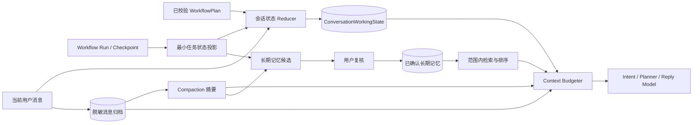

# AgentFlow 记忆系统开发与验收计划

> 状态：实施中（MEM-0、MEM-1、MEM-2、MEM-3、MEM-4 已完成，MEM-5 待执行）
>
> 建立日期：2026-09-10
>
> 输入基线：`docs/Agent开发技术要点（持续更新）.md` 第 5 章、`docs/AGENT_MEMORY_IMPLEMENTATION_AUDIT.md`、当前代码与离线回归
>
> 适用范围：AI 调度台会话记忆、Commander 工作状态、Runtime 状态投影、跨会话长期记忆及其管理入口

## 1. 目标与边界

本计划解决四个客户可感知问题：

1. 同一会话继续交流时，Agent 能准确知道当前目标、已确认约束、未完成事项和任务进度。
2. 用户明确修改条件时，新值替换旧值；存在歧义时进入待确认状态，不把互相冲突的内容同时当真。
3. 跨会话只召回用户确认、当前范围相关的长期事实，不因其它项目数据量增加而漏召回或串线。
4. 对话变长、应用重启或 Runtime 中断后，重要状态仍可恢复，并且上下文始终受模型窗口和隐私边界约束。

本轮路线继续使用 AgentFlow 自有的 FastAPI、Pydantic、SQLite、Workflow Runtime 和 ModelGateway。LangChain 或 LangGraph 的类名不作为验收条件；文档中的“约 20k token”和“向量/BM25 7:3”作为候选设计，最终参数由本项目评测决定。

聊天原文、当前工作状态、Runtime checkpoint、长期记忆和程序性规则必须分层管理。用户确认边界、项目隔离、任务审计和现有完整归档不得因优化召回而削弱。

## 2. 目标架构

| 层 | 唯一职责 | 事实来源 | 是否直接进入 Prompt |
|---|---|---|---|
| 消息归档 | 保存客户实际看到的脱敏对话 | 成功聊天响应、受控异步交付 | 仅取预算内最近原文 |
| 当前工作状态 | 保存当前目标、有效约束、待办和活动任务 | 当前用户消息、已校验计划、Runtime 状态 | 是，始终优先保留 |
| Compaction 摘要 | 压缩较早的对话经历 | 已归档消息 | 是，但不能覆盖当前工作状态 |
| Runtime 状态 | 保存步骤、工具、产物、失败和恢复点 | Workflow Engine / Checkpoint | 只投影最小状态 |
| 长期记忆 | 跨会话保存稳定偏好、项目约束和经验 | 用户确认的候选 | 按范围检索 Top K |
| 程序性规则 | 保存 Agent 的稳定执行方法 | Agent Definition、Node Contract、项目 Skill | 由 Harness 加载，不写入用户记忆表 |

## 3. 不可破坏的规则

### 3.1 状态优先级

同一字段发生冲突时，按以下顺序更新：

1. 当前轮用户明确修改。
2. 用户确认后的计划修订。
3. Runtime 已验证状态或已回读产物。
4. 之前保存的当前工作状态。

助手自然语言、未执行计划和未验证 Tool 输出不能把任务标成已完成。无法判定是“补充”还是“替换”时，保存为 `pending_confirmation`，由下一轮向用户确认。

### 3.2 隔离与隐私

- 短期状态必须同时校验 `conversation_id` 和 `project_scope`。
- 长期记忆只能查询 `global` 和当前明确项目范围。
- API Key、令牌、私钥、绝对路径、完整客户文档、原始 Tool 日志和模型隐藏推理不得进入长期记忆。
- 长期记忆默认关闭；关闭时不得读取长期记忆表或更新 `last_used_at`。
- 自动流程只能创建候选，永久保存继续要求用户明确确认。

### 3.3 上下文与恢复

- 当前工作状态不依赖 Compaction 摘要存活。
- 每次 Prompt 组装必须记录估算输入、分配给记忆的预算、实际使用量和降级原因，不记录正文。
- 数据库 migration 只向前升级，并用旧库夹具验证会话、消息和长期记忆可回读。
- 任何一次恢复都不能重复写入已完成交付或重复执行已完成步骤。

## 4. 目标数据契约

### 4.1 `ConversationWorkingState v1`

建议以独立 JSON 列或独立表持久化，Pydantic 协议至少包含：

| 字段 | 内容 | 更新方式 |
|---|---|---|
| `revision` | 单调递增版本 | 每次有效更新加一 |
| `current_goal` | 当前任务目标及来源消息 | 明确新目标覆盖；补充目标合并 |
| `constraints` | 键、当前值、状态、来源 | 同键新值覆盖旧值，保留修订审计 |
| `decisions` | 已确认选择及理由摘要 | 只接受用户确认或已校验计划 |
| `open_items` | 未完成事项、负责人、状态 | Runtime 完成后关闭，不能只追加 |
| `active_task` | task/plan、状态、当前步骤、下一动作 | 从任务仓库投影 |
| `latest_verified_result` | 最小结果和 artifact 引用 | 只接受已完成且通过 Verifier 的结果 |
| `updated_at` | 最近有效更新时间 | 服务端生成 |

每个可变项必须保留来源类型和来源 ID。完整变更历史继续由消息、计划版本和任务事件承担，Working State 只保存当前有效快照。

### 4.2 长期记忆候选与记录

候选需要稳定保存 `pending/confirmed/rejected/expired` 状态，并增加来源会话、来源消息或任务、内容指纹和过期时间。正式记忆需要支持内容指纹去重、`supersedes_memory_id` 替代关系和可选有效期，避免“默认预算 5000”和“默认预算 3000”同时生效。

现有三类保持兼容：

- `user_preference`：跨项目稳定偏好。
- `project_constraint`：特定项目长期约束。
- `experience`：有来源任务、可复用的已验证经验。

程序性记忆暂不加入用户长期记忆枚举；产品内 Agent 自动生成 Skill 属于后续独立能力。

## 5. 分阶段开发门禁

### MEM-0：固定基线与评测集

**工作内容**

- 建立版本化、合成且脱敏的 `memory_eval_cases`，首版不少于 48 例：状态更新 12、任务进度/恢复 8、长会话压缩 8、长期召回 8、范围隔离 6、隐私边界 6。
- 将用例分成 `required` 与 `diagnostic`；required 失败必须阻止后续阶段出口。
- 记录当前实现的状态准确率、Recall@3、误召回、上下文 token 估算、检索耗时和重启恢复结果。
- 固定两个已确认缺陷：Intent 只读取会话上下文前 2200 字符；长期检索先取全库最新 200 条再做 scope 筛选。

**出口条件**

- 所有夹具不含真实客户正文、路径或凭据，并可在临时 SQLite 中离线重复运行。
- 相同提交连续运行三次，required 结果完全一致。
- 基线报告如实保留失败项，不以调整预期答案让旧实现通过。

**实施记录（2026-09-10）**

- 已建立 `backend/scripts/fixtures/memory_eval_cases_v1.json` 与 `backend/scripts/verify_commander_memory_quality.py`，覆盖 48 例合成脱敏夹具。
- 三次 baseline 的 required 结果签名一致；48 个分类夹具当前为 26 例通过、2 例失败、20 例未支持，另有 2 个 MEM-1 确定性探针失败。`--mode gate` 已确认会对未通过 required 用例返回非零。
- 详细基线、指标和失败证据见 `docs/AGENT_MEMORY_MEM0_BASELINE.md`；下一阶段只能修复该报告中的确定性遗漏，不能通过放宽夹具预期放行。

### MEM-1：修复确定性召回遗漏

**工作内容**

- Intent 路由改为读取结构化状态和最新消息；有限字符预算从尾部保留最新上下文，不能只截取开头。
- 长期记忆在 SQL 层先按 `scope + enabled + user_confirmed` 筛选，再排序和限制候选数。
- `last_used_at` 只在记忆实际进入成功生成的计划或回复后更新。
- 增加超过 200 条其它项目噪声、长对话尾部修改和模型失败后的使用时间回归。

**出口条件**

- 最新明确要求进入 Intent/Planner 的 required 用例通过率 100%。
- 当前项目的精确长期记忆在 500 条跨项目噪声下 Recall@3 为 100%。
- 跨项目召回数为 0；模型或计划失败时 `last_used_at` 不变化。
- 现有会话、记忆、规划和后端离线回归全部通过。

**实施记录（2026-09-10）**

- Intent 的 2200 字符窗口改为“前缀锚点 + 省略标记 + 最新尾部”，固定探针确认最新要求进入 JSON payload。
- 长期记忆改为 SQL 层先按 `scope + enabled + user_confirmed` 过滤、再在最多 200 条同范围候选内进行词面排序；500 条其它项目噪声不再挤掉当前项目记录。
- 检索与使用审计分离：仅在 mock/LLM 回复、稳定计划或计划修订已成功完成后更新 `last_used_at`；真实 LLM 失败注入确认不会污染使用时间。
- `--mode gate --gate-profile mem1` 连续三次通过，详细结果见 `docs/AGENT_MEMORY_MEM1_ACCEPTANCE.md`。

### MEM-2：当前工作状态模型

**工作内容**

- 新增 `ConversationWorkingState` schema、Repository、前向 migration 和状态 Reducer。
- 从用户消息提取受限候选；Harness 根据字段白名单、来源和当前状态决定覆盖、合并或待确认。
- 从 WorkflowPlan/Run 投影活动任务、步骤状态、下一动作和最新验证结果。
- Prompt、会话恢复 API 和计划审计使用同一份状态快照，禁止各自重新猜测。
- 初版支持目标、交付格式、预算、材料范围、数量要求、时间范围、待办和任务状态；未注册字段只留在对话原文。

**出口条件**

- “预算 5000 -> 改成 3000”等 12 个状态修改 required 用例最终只保留新值，字段准确率 100%。
- 含糊修改不会覆盖旧值，必须产生一条待确认项。
- Runtime 完成、失败、暂停和恢复能更新对应 open item，终态准确率 100%。
- 重启前后 Working State JSON 完全一致；重复事件不增加 revision 或重复结果。
- 旧数据库升级后消息、摘要、task/plan 指针和长期记忆数量保持一致。

**实施记录（2026-09-10）**

- 新增独立 `commander_conversation_working_states` 前向迁移、`ConversationWorkingState v1` Pydantic 契约和带 `revision` 的乐观并发 Repository。旧会话在首次可信状态写入前返回 revision=0 空快照，不改写原消息或摘要。
- `conversation_working_state.py` 以白名单 Reducer 更新目标、预算、交付格式、材料范围、页数、时间范围、语言、表格要求、方案选择与待确认字段；未识别或含糊变更不覆盖已有值。助手自然语言不进入 Reducer，不能凭“已完成”关闭事项。
- Workflow 保存成功后才投影最小活动任务、步骤、下一动作和 open item；`latest_verified_result` 严格限于 `mode=runtime` 的已登记 artifact，dry-run 虚拟产物不能被写成真实交付。
- Prompt、计划审计和恢复 API 经 `ConversationContext.working_state` 复用同一快照。`--mode gate --gate-profile mem2` 的 48 个夹具与 3 个既有探针共 51 项全部通过，状态字段准确率和任务恢复一致性均为 100%；详情见 `docs/AGENT_MEMORY_MEM2_ACCEPTANCE.md`。

### MEM-3：统一上下文预算与 Compaction

**工作内容**

- 建立统一 `ContextEnvelope`，供 Intent、Planner 和最终回复共同消费，消除各层独立截断。
- 已核验模型按 `context_window - 输出预留 - 系统/工具/当前输入 - 安全余量` 计算记忆预算，上限 20k token；未知模型使用保守回退预算。
- 始终优先放入 Current Working State，再放长期记忆、Compaction 摘要和最近完整轮次。
- 至少保留最近一组完整用户/助手轮次；超预算时按整轮压缩，不留下只有助手回复的断裂上下文。
- 评估确定性摘要与受控 LLM 摘要。只有 LLM 方案在信息保留率上明显提升、失败可回退且成本可记录时才准入。

**出口条件**

- Intent、Planner、Reply 三条路径读取相同的目标、约束和最新消息，required 一致率 100%。
- 任何夹具的实际记忆输入不超过分配预算；当前工作状态保留率 100%。
- Compaction 后目标、有效约束、未完成事项、task/plan ID 的 required 保留率 100%。
- 摘要失败、Provider 超时或 JSON 无效时回退到确定性摘要，不丢失当前状态、不重复写库。
- 不把 token 估算写成 Provider 实际 usage；真实 usage 仅采用供应商响应。

**实施记录（2026-09-10）**

- 新增 `ContextEnvelope` 和无正文 `ContextEnvelopeAudit`：同一份被选择的上下文由 Intent JSON、Commander 计划审计和最终回复共同消费；移除了 Intent 独有的 2200 字符二次截断。
- 预算统一按 `context_window - output_reserve - system/tool_reserve - current_input - safety_margin` 计算，已核验 DeepSeek V4 使用 1M 窗口，其它 Runtime 固定回退为 16,384 token；记忆输入硬上限为 20k。估算值明确标记为本地估算，不能作为 Provider usage。
- 选择顺序固定为 Working State、已确认长期记忆、确定性压缩摘要/会话锚点和最近完整 user/assistant 对话；超额时只在信封内成对压缩，异步 delivery-only 助手消息不会作为半轮上下文注入。无法同时保留工作状态与最新完整轮次时在模型调用前明确失败，不静默丢字段。
- Working State Prompt 摘要补充 active task 的 plan ID、所有未完成事项和已验证 artifact 标识。`verify_commander_context_envelope.py` 以合成夹具覆盖已核验/回退预算、20k 上限、三路径一致性、完整轮次、过长轮次裁剪和无安全预算拒绝；详情见 `docs/AGENT_MEMORY_MEM3_ACCEPTANCE.md`。
- LLM 摘要未准入：当前确定性 compaction 未显示需要用额外模型调用替代的量化收益，且还没有对应的成本记录与失败回退证据。

### MEM-4：长期记忆沉淀与冲突治理

**工作内容**

- 持久化长期记忆候选；任务完成和 Compaction 前都可生成候选，但不直接创建正式记忆。
- 候选仅来自用户明确长期表达、已验证项目约束或成功任务经验，保存来源和可解释原因。
- 引入指纹去重、同键冲突检测、替代关系、拒绝和过期状态。
- 用户确认前允许编辑标题、摘要、标签和范围；确认操作保持幂等。
- 为设置页和任务结果提供待确认候选的查看、确认、拒绝入口。

**出口条件**

- 一次性要求不会产生候选；明确“以后每次”类 required 用例候选召回率 100%。
- 未确认候选进入正式长期记忆的数量为 0。
- 同内容重复确认只产生一条记录；新偏好替代旧偏好后检索只返回当前有效值。
- 候选中的凭据、绝对路径和原文长段落拦截率 100%。
- Compaction、任务恢复或 API 重试不会重复生成等价候选。

**实施记录（2026-09-11）**

- 新增前向 SQLite migration `20260910_long_term_memory_candidate_lifecycle_v1`：候选账本保存脱敏短事实、来源类型/标识、内容指纹、冲突键、`pending/confirmed/rejected/expired/superseded` 状态及候选/正式记忆替代关系；未确认候选与 `long_term_memories` 分表，不参与检索。
- 已完成 Commander Runtime 只从客户明确长期表达生成可重放候选，并标记为已验证项目约束；客户明确要求沉淀且有真实 artifact 的成功任务可标记为可复用经验。普通会话在 Compaction 前提取强长期表达，用户/助手消息和 Working State 成功归档后才落账。
- 任务结果与设置 API 均提供待确认候选的查看、确认、拒绝；Qt 任务历史与长期记忆管理页接入同一候选复核链路。确认允许编辑范围、标题、摘要和标签，保持幂等。相同内容由指纹去重；同键新值确认时停用旧有效记忆，检索只返回当前值。
- 为防止原始聊天侧漏，候选拒绝凭据、绝对路径和超过 600 个规范化字符的源消息，也不会把“一次性且不保存为长期偏好”之类否定表达升级为候选。详情见 `docs/AGENT_MEMORY_MEM4_ACCEPTANCE.md`。

### MEM-5：长期记忆检索评测与 Hybrid 准入

**工作内容**

- 先以修正后的词面检索建立基线，再评估 SQLite FTS5 BM25。
- 复用现有知识库本地向量能力做可选 Dense 候选，不新建第二套 embedding 供应链。
- Hybrid 优先评估现有知识库采用的 RRF；同时把文档中的 7:3 加权作为对照实验，按 required/diagnostic 指标选型。
- 结构化精确约束、全局偏好和语义候选分别召回，最终统一去重和范围校验。
- Dense 不可用时明确降级到 BM25/词面检索，不能返回跨范围结果。

**准入指标**

| 指标 | required 门槛 | diagnostic 门槛 |
|---|---:|---:|
| Recall@3 | 100% | 不低于 85% |
| MRR | 不低于 0.95 | 不低于 0.80 |
| 冲突旧值召回 | 0 | 0 |
| 跨范围泄漏 | 0 | 0 |
| 10,000 条本地记忆 BM25 P95 | 不高于 100 ms | 记录事实 |
| 本地 Hybrid P95 | 不高于 500 ms | 记录事实 |

Hybrid 只有在语义改写用例上优于 BM25，并且 required 指标、延迟、打包体积和降级回归同时通过后才进入默认路径。没有增益时保留 BM25/词面方案。

### MEM-6：生命周期、管理入口与可观测性

**工作内容**

- 增加会话归档、单会话删除、按项目清理和可配置保留期。自动过期默认关闭，用户主动配置后才生效。
- 删除操作校验 project scope，并级联清理 Working State、消息和待确认候选；任务历史按其独立保留策略处理。
- 设置页展示长期记忆开关、范围、状态、来源、最近使用时间和待确认候选；危险清空继续要求确认。
- 记录无正文指标：上下文预算、压缩次数、摘要消息数、检索模式、候选数量、召回 ID、延迟和降级原因。

**出口条件**

- 删除/清理不能跨项目；范围泄漏和误删数量均为 0。
- 删除后会话、Working State、消息和候选没有孤儿记录，`foreign_key_check` 通过。
- 自动保留期关闭时数据不会被后台删除；开启后的边界时间夹具结果稳定。
- UI 的开关、确认、拒绝、删除、清空和会话恢复均与后端真实状态一致。
- 可观测记录不包含客户正文、标题内容、文件名、路径、凭据或 embedding。

### MEM-7：真实模型与客户路径验收

**前置条件**

- MEM-0 至 MEM-6 的 required 离线门禁全部通过。
- 使用脱敏固定夹具；真实 Provider 调用需使用客户已配置的模型，并单独记录预计次数和输出预算。

**验收场景**

1. 连续修改预算、格式和材料范围，最终计划只使用最新值。
2. 超长会话触发 Compaction，继续询问较早但仍有效的约束。
3. 异步任务暂停、重启、恢复和完成后继续对话。
4. 新会话召回已确认全局偏好，不召回一次性任务。
5. 两个项目存在相似约束时只召回当前项目。
6. 语义改写能够命中相同长期记忆。
7. Dense 组件不可用时显示降级事实且仍可完成。
8. 用户关闭长期记忆后，新请求不读取、不注入、不更新使用时间。

**最终出口条件**

- 8 个场景的模型行为和后端审计事实一致，成功率 100%。
- 不出现跨会话、跨项目或未确认记忆泄漏。
- Qt 中会话切换、恢复、候选确认和删除均完成一次人工验收。
- 真实模型失败时给出可操作原因，恢复不重复调用已完成步骤。
- 真实调用次数、Provider usage 和测试数据范围写入脱敏验收记录。

## 6. 自动验证体系

| 验证层 | 覆盖内容 | 运行方式 |
|---|---|---|
| Reducer 单元回归 | 覆盖、合并、冲突、待确认、幂等 | 纯 Python，无数据库 |
| Repository 回归 | migration、事务、水位、scope、删除级联 | 临时 SQLite |
| API 回归 | 会话、状态、候选、确认、开关和清理 | FastAPI TestClient |
| Runtime 故障注入 | 暂停、失败、重启、恢复、重复事件 | Mock Tool / Mock Model |
| Context 回归 | 三条模型路径的一致上下文与预算 | MockTransport |
| Retrieval Eval | Recall@3、MRR、误召回、降级和延迟 | 合成记忆库 |
| Qt 自动回归 | JSON 兼容、会话切换、设置与候选状态 | Qt Test / CTest |
| 真实验收 | 8 个固定场景及 Provider usage | 明确授权后单独运行 |

每个阶段至少运行本阶段专项、`verify_backend.py`、Python 编译和依赖检查。触碰 Qt 时增加 Debug 构建与 CTest；触碰 migration 时增加旧库升级、重复启动和 `foreign_key_check`。

## 7. 质量指标定义

- **状态字段准确率**：最终 Working State 中字段值与夹具期望完全一致的比例。
- **有效信息保留率**：Compaction 后仍能从 ContextEnvelope 取得的 required 目标、约束、待办和标识符比例。
- **Recall@3**：期望长期记忆是否出现在前三条结果中。
- **MRR**：首条正确长期记忆排名的倒数均值。
- **误召回率**：不相关、已替代、未确认或错误范围记忆进入 Prompt 的比例。
- **恢复一致率**：重启前后 Working State、活动任务和已完成结果完全一致的比例。
- **预算超限率**：实际记忆输入超过 Context Budgeter 分配值的请求比例，required 门槛为 0。
- **隐私违规数**：正文、路径、凭据、隐藏推理或跨范围内容进入错误存储/Prompt/指标的数量，门槛为 0。

## 8. 提交与回退规则

- 每个 MEM 阶段使用独立提交，提交信息采用 `类型：结果摘要`；阶段出口通过后才推送并更新状态文档。
- Schema 先提供兼容读取，再执行前向 migration，最后切换写入；不能同一提交删除旧字段。
- 新 Working State、候选检索和 Hybrid 路径都必须有独立开关或兼容回退，直到对应阶段出口通过。
- required 用例失败、跨范围泄漏、未确认写入、migration 不可重复、预算超限或恢复重复执行时，立即停止后续阶段。
- 回退只关闭新读写路径，不回滚数据库文件；已写入的新字段保持可忽略和可审计。

## 9. 实施顺序

1. MEM-0 建立评测和当前失败基线。
2. MEM-1 修复 Intent 尾部丢失、scope-before-limit 和使用时间语义。
3. MEM-2 建立 Current Working State 与任务投影。
4. MEM-3 统一三条模型路径的 ContextEnvelope 和动态预算。
5. MEM-4 建立候选生命周期、冲突替代和 Compaction 前候选。
6. MEM-5 用评测决定 BM25 或 Hybrid 默认方案。
7. MEM-6 完成清理、管理入口和可观测性。
8. MEM-7 进行有限真实模型和 Qt 客户路径验收。

## 10. 完成定义与简历边界

全部 MEM-0 至 MEM-7 出口通过后，记忆系统才能描述为：

> 设计并实现分层 Agent 记忆系统，将会话原文、结构化工作状态、可恢复任务 checkpoint 与用户确认式长期记忆解耦；支持模型窗口感知的 Compaction、范围隔离、冲突更新、候选治理、可降级 Hybrid 检索和端到端质量评测。

在此之前，简历继续使用已经成立的表述：会话持久化、有限上下文压缩、项目隔离、任务恢复和用户确认式长期记忆。阶段计划、未准入 Hybrid、自动技能沉淀和未完成真实验收不能写成已实现能力。
