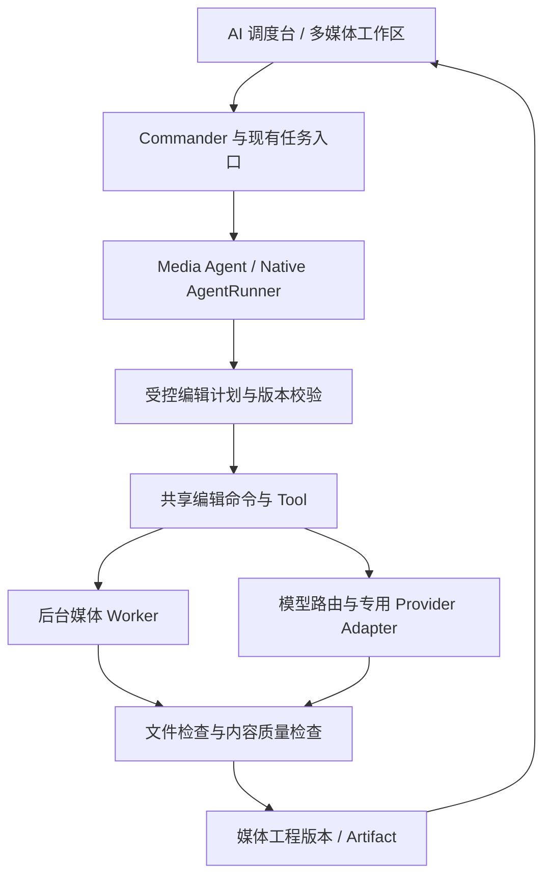

# AgentFlow 多媒体助手开发计划

> 版本：v0.1 | 建立日期：2026-09-16
>
> 状态：规划文档已建立，MM-0 至 MM-7 均未开始；本文件不代表功能已实现或评测已通过。
>
> 配套文件：[评测与验证方案](MULTIMEDIA_AGENT_EVALUATION.md)。阶段、能力和验收编号在两份文档中共同维护。

## 1. 本次决策与执行范围

在现有 AgentFlow 内建设一个多媒体助手，暂定 `media_agent`，复用 Commander、Native AgentRunner、Workflow Runtime、SQLite、模型配置与任务历史。用户从自然语言提出需求，在可预览、可修改的工作区完成图片和音视频任务。

2026-09-16 用户同意将前一轮 GitHub 调研整合为开发计划与评测文档。本轮交付范围为文档，不安装依赖、不调用付费模型、不注册可执行 Agent。后续用户要求“开始”或“下一步”时，按本计划第一个未完成阶段推进，例行技术取舍不重复询问；扩大产品范围、增加未授权费用或外发用户材料，仍按用户授权与现有权限策略处理。

| 决策 | 本计划采用的方案 |
| --- | --- |
| 主线顺序 | AI 修图 -> 对话式视频剪辑 -> 视频翻译与配音，逐个形成完整闭环 |
| 产品价值 | 用户可以连续修改结果、撤销、重新打开工程并导出成品；转码、抽帧、转写只是工具 |
| 首期用户 | 有照片编辑需求的个人用户、内容创作者和小团队，不限定电商、工业或 PPT 场景 |
| Agent 边界 | 先一个 `media_agent`，按图像、剪辑、翻译配音加载对应工具与上下文；ASR/TTS/分割属于工具或 Provider |
| 与既有 Agent 协作 | 多媒体助手独立完成媒体任务；文档、数据、知识库的组合调用放在单项能力通过验收之后 |
| 运行方式 | Windows 本地优先，云模型可选；重模型依赖按需准备，不增加默认启动下载或加载 |
| 成本属性 | 基础本地编辑与工程管理作为内置能力；外部模型用量和本地硬件需求明确展示，本计划不决定订阅定价 |
| 开工依据 | 各阶段的入口条件、交付件、G0-G7 门槛；不能用新增页面、工具数量或模型返回成功代替验收 |

## 2. 功能清单与取舍

### 2.1 三条正式规划主线

| 能力编号 | 功能 | 必须交付的用户体验 | 首次交付阶段 |
| --- | --- | --- | --- |
| IMG-01 | 图片工程与画布 | PNG/JPEG 导入、缩放平移、选择对象、前后对比、保存再打开、导出新文件 | MM-1 |
| IMG-02 | 确定性编辑 | 亮度/对比度/饱和度、裁剪、缩放、旋转；手动与 Agent 共享同一命令入口 | MM-1 |
| IMG-03 | 选区与局部 AI 编辑 | 笔刷/框选蒙版、局部消除、局部替换或换背景；明确“只修改哪里” | MM-2 |
| IMG-04 | 连续对话修图 | “上一版”“只改背景”“撤销刚才那步”绑定真实工程版本，不能靠聊天猜测 | MM-2 |
| IMG-05 | 最小图层与可逆历史 | 原始层、编辑结果层和蒙版引用；可见性、前后版本与撤销重做；不承诺 PSD 兼容 | MM-1/MM-2 |
| IMG-06 | 可靠图片交付 | 原图不覆盖、局部修改边界验证、图像回读、可从调度台预览与取回 | MM-3 |
| VID-01 | 视频工程与时间轴 | 本地视频导入、预览、字幕文本与源时间对应、片段边界和顺序可改 | MM-4 |
| VID-02 | 对话式剪辑 | 根据内容保留/删除段落、选择重录版本、组合片段；结果对应真实剪辑决策 | MM-5 |
| VID-03 | 字幕与导出 | 编辑字幕、导出 SRT 与 MP4，可选择是否烧录字幕；处理后字幕与新时间轴对齐 | MM-5 |
| VID-04 | 增量修改 | 改片段或字幕时只使相关结果失效，复用有效转写；重新打开工程可继续编辑 | MM-5 |
| LOC-01 | 视频翻译 | 首批中英双向翻译、术语表、数字与名称保留、原文/译文对照修改 | MM-6 |
| LOC-02 | 配音与时长对齐 | 选定合成声音、分段配音、试听和局部重配；保留环境声的能力单独声明 | MM-6 |
| LOC-03 | 多种交付合同 | 仅字幕、字幕视频、配音视频分别验收，用户要求配音时不能只交字幕却报全部成功 | MM-6 |
| LOC-04 | 模型与成本可控 | 翻译模型、ASR、TTS 独立配置，支持的语言和参数来自实际 Provider 能力 | MM-6 |

首期修图范围是 IMG-01 至 IMG-06。必须包含真实局部 AI 编辑与连续修改，不能只完成亮度调整便声称 AI 修图已交付。自动语义选区可在手工蒙版闭环后加入；复杂拆层、生成文字层、文生图和扩图可复用工程协议扩展，但不构成首期承诺。

### 2.2 保留的扩展方向

| 编号 | 候选方向 | 归属与价值 | 启动条件 |
| --- | --- | --- | --- |
| EXT-01 | AI 视频解说与成片 | 视频能力扩展：画面理解、解说脚本、配音、选段合成 | 剪辑和配音均通过验收；建立脚本与画面对应评测 |
| EXT-02 | 语言控制声音分离 | 音频工具：按文字、对象或时间范围保留/去掉目标声音 | 权重访问与许可明确；盲听证明分离效果及声音损伤可接受 |
| EXT-03 | 智能配音与声音设计 | 共享 TTS 能力：语气、角色、局部重配 | 基础 TTS 稳定后扩展；声音克隆须有明确授权来源 |
| EXT-04 | 资料转有声讲解/播客 | 文档/知识库与音频组合：脚本可审阅、来源可复核、音频可交付 | LOC 基础及文档证据链通过；不得捏造来源中的事实 |
| EXT-05 | 视频目标追踪与局部处理 | 视觉工具：目标持续打码、突出显示、分离或消除 | 跟踪丢失、遮挡、跨帧一致性及模型许可专项评测通过 |
| EXT-06 | 图片/文字生成视频 | 生成式 Provider：镜头生成与现有素材组合 | 算力/费用基线可接受，具备可预览和局部重生成流程 |
| EXT-07 | 实时语音与视觉互动 | 平台交互扩展：看画面、听用户说话、可打断会话 | 独立实时会话 ADR 与延迟/回声/打断验收；不塞入批处理 Runtime 冒充流式能力 |

扩展方向进入开发时，必须在两份文档中增加自己的阶段、夹具、预算、能力声明和通过记录。不能仅因依赖已安装，就自动开放全部模型功能。

## 3. 开源参考与使用边界

调研日期：2026-09-16。以下为仓库说明、目录与部分关键源码的静态调研，不是本机运行结论。MM-0 应为实际选中的依赖记录 commit/tag、代码许可、模型权重条款、下载来源和 Windows 验证结果。

| 参考项目 | 已观察到的结构/能力 | 在本项目中的用途 | 已知边界 |
| --- | --- | --- | --- |
| [ai-picture-editor](https://github.com/yuyuanweb/ai-picture-editor) | 修图工程、选区与图层、多工具计划；原 ai-retouch-agent 链接已重定向 | 参考统一编辑命令、画布上下文、计划校验与修订流程 | 教学项目；公开仓库未见明确 LICENSE，不能据公开可读推断可复制发布 |
| [video-use](https://github.com/browser-use/video-use) | 转写、按需时间轴图、剪辑决策、渲染与自评流程 | 参考按需读媒体、EDL 与有限修正 | coding-agent Skill 与 Python 工具组合；不是可直接嵌入 Qt 的编辑器，原流程有外部转写服务依赖 |
| [FunClip](https://github.com/modelscope/FunClip) | 按转写文本/说话人剪辑、字幕、LLM 辅助选段 | 参考中文语音定位和文本驱动剪辑 | ASR、依赖版本和时间戳须本机验证；不继承 README 的效果宣传 |
| [VideoLingo](https://github.com/Huanshere/VideoLingo) | 转写对齐、术语、翻译、字幕分段与配音 | 参考视频本地化任务分解和局部恢复 | ASR/TTS 依赖与支持语言分别核验，GPU/CPU 路线单独评估 |
| [NarratoAI](https://github.com/linyqh/NarratoAI) | 画面分析、解说生成、音频处理与视频导出 | EXT-01 流程参考 | 使用原仓库而非条款不同的 fork；当前根 LICENSE 为 MIT，模型/素材另核 |
| [SAM-Audio](https://github.com/facebookresearch/sam-audio) | 文本、视觉、时间提示的声音分离 | EXT-02 候选模型 | 权重需申请，GPU 推荐；底层模型不是 Agent |
| [Qwen3-TTS](https://github.com/QwenLM/Qwen3-TTS) | 语音生成、声音设计与可选克隆 | LOC/EXT-03 的 TTS 候选 | 各型号能力不同，不能把一种模型的能力套到所有型号 |
| [Open Notebook](https://github.com/lfnovo/open-notebook) | 多来源材料与多角色播客生成 | EXT-04 脚本到音频的流程参考 | 复用设计思路，不额外引入整套知识库和数据库 |
| [Grounded-SAM-2](https://github.com/IDEA-Research/Grounded-SAM-2) / [ProPainter](https://github.com/sczhou/ProPainter) | 提示定位、分割跟踪 / 视频修补 | EXT-05 候选工具组合 | 仍需自己建设 Agent 编排；ProPainter 明确限制非商业用途 |
| [Wan2.2](https://github.com/Wan-Video/Wan2.2) | 文生视频、图生视频等模型与推理代码 | EXT-06 候选 Provider | 显存和耗时取决于模型及参数，不能承诺普通 CPU 实时生成 |
| [Pipecat](https://github.com/pipecat-ai/pipecat) | 实时语音、多模态会话和多 Provider 管线 | EXT-07 实时架构参考 | 需要独立实时传输、打断和媒体时钟设计，不替换现有批任务所有权 |

[修图项目的 graph.py](https://github.com/yuyuanweb/ai-picture-editor/blob/main/backend/app/agent/graph.py) 展示了“规划 -> 校验”的分工，工具执行另由服务负责。AgentFlow 应保留自己的 AgentRunner 与权限链，不为复现框架名字迁移主运行时。

## 4. 与现有代码对齐

| 当前代码入口 | 可复用部分 | 本计划需要增加的部分 |
| --- | --- | --- |
| [agents/runner.py](../backend/app/agents/runner.py) | AgentDefinition、结构化 Tool、调用次数和输出修复上限 | 媒体 Agent 的 Definition、阶段工具集和最终交付 schema |
| [agents/registry.py](../backend/app/agents/registry.py) | manifest 发现与校验 | 完成注册前核对实际 action readiness，不能一开 Agent 就开放全部候选动作 |
| [workflow/node_contracts.py](../backend/app/workflow/node_contracts.py) | Agent/action 的输入输出、权限、失败码 | 修图、剪辑、翻译配音的最小 Node Contract |
| [workflow/runtime.py](../backend/app/workflow/runtime.py) / [runtime_jobs.py](../backend/app/workflow/runtime_jobs.py) | 任务生命周期、后台执行和恢复 | 受控媒体 worker、阶段检查点、取消与未知外部结果处理 |
| [database/sqlite.py](../backend/app/database/sqlite.py) / [task_repository.py](../backend/app/database/task_repository.py) | 前向迁移、任务、权限、checkpoint、artifact | 媒体资产与工程版本元数据；不另建一套任务状态数据库 |
| [services/model_gateway.py](../backend/app/services/model_gateway.py) | 文本调用、Tool Calling、Provider 和图像生成配置基础 | 当前 ModelConversationMessage 以字符串为主；补受控图像输入、媒体能力声明及专用模型适配 |
| [services/model_route_store.py](../backend/app/services/model_route_store.py) | 任务路由、用户覆盖、参数过滤 | 媒体规划、视觉理解、图片编辑、转写、翻译、配音的阶段配置 |
| [schemas/workflow.py](../backend/app/schemas/workflow.py) | 既有任务枚举、控制动作、产物类型 | 优先保持兼容；媒体 MIME/工程信息作为元数据，不随意扩展全局状态枚举 |
| [mainwindow.ui](../mainwindow.ui) | Qt Designer 布局、工作台导航、现有视觉体系 | 按阶段增加画布、片段/字幕编辑和预览；重处理不进入 UI 线程 |

## 5. 目标架构与数据契约

### 5.1 首期最小契约

以下名称与字段均为拟新增契约；以实现时的 Pydantic schema 为准，变更须同步评测。MM-1 只实现图片闭环必需字段，视频结构在 MM-4 增加，避免提前建设通用媒体平台。

| 契约 | 关键字段 | 约束 |
| --- | --- | --- |
| `MediaAsset v1` | asset_id、project_scope、content_hash、mime、metadata、parent_asset_ids | 原始文件受控保存，衍生产物保留来源；路径在服务端解析，模型只见 ID |
| `MediaProject v1` | project_id、project_scope、mode、revision、source_asset_ids、current_result | 与会话分离持久化，重启可打开；revision 单调递增 |
| `ImageRevision v1` | revision、parent_revision、canvas、layers、mask_refs、operation_refs | 蒙版绑定具体版本、坐标变换与层；变换后不能使用失效蒙版 |
| `MediaEditPlan v1` | plan_id、base_revision、goal、steps、requirements、budget、permission_ref | 步骤有类型化参数和依赖；批准绑定版本、计划摘要及外发范围 |
| `MediaOperation v1` | operation_id、tool_version、input_hashes、params、attempt、result_refs | 同一逻辑动作与不同 attempt 分开；工具结果不含无界二进制 |
| `MediaVerification v1` | requirement_id、check_id、status、evidence_refs、warnings | 文件有效、内容符合要求分别记录，未检查不能标通过 |
| `agentflow.delivery.v1` | status、headline、summary_markdown、facts、warnings、artifacts、next_actions | 沿用既有交付原则；结果和实际 artifact 一致，缺少必需结果不得报全部成功 |

编辑命令是模型与人工操作的共同入口。每次提交先校验 `base_revision`，执行结果提交前再次比较当前 revision；若用户已修改工程，旧结果只保留为候选，不能覆盖新版本。撤销通过保存的历史结果恢复，不重新调用模型；已发生的云端费用不能被撤销。

### 5.2 视频与音频的后续契约

| 契约 | 关键内容 | 约束 |
| --- | --- | --- |
| `Transcript v1` | 源素材、ASR 模型版本、语言、词/句段、起止时间 | 用户修正产生新版本；未知说话人保持匿名，不能推断真实身份 |
| `EditDecisionList v1` | clip_id、源 asset、source in/out、输出位置、音轨与字幕引用 | 使用半开区间和显式 time_base；以源 PTS 换算，不以帧号除标称 FPS 处理 VFR |
| `LocalizationProject v1` | 源字幕版本、译文、术语、voice profile、分段音频、对齐策略 | 修改译文使相应 TTS/混音失效，转写不因此全量重跑 |

EDL 采用整数 tick 与有理数 time_base 保存，UI 可显示秒。原音视频起始偏移、旋转元数据、重采样和代理视频到原素材的映射必须保留。首版精确裁剪走已验证的解码/重编码路径；不能把关键帧附近的 stream copy 当作任意时间点精确裁剪。

### 5.3 文件、缓存与恢复

- 媒体二进制、蒙版、缩略图、分段音频在受控文件区，SQLite 保存引用与元数据；不把视频或 base64 全文放进 checkpoint、消息归档或长期记忆。
- 缓存键至少包含源哈希、工程/蒙版版本、工具与模型版本、影响结果的参数。命中只是复用旧结果，不承诺生成模型可重现相同像素。
- 输出先写临时文件，回读后原子提交并登记 artifact；记录提交意图，在“文件已完成但数据库未登记”崩溃窗口进行对账，避免重复交付。
- 默认一个重计算 worker，限制队列、像素数、时长、临时磁盘和调用预算；并发提升必须有基准支持。CPU/GPU 工作不阻塞 FastAPI 事件循环。
- 提交接口快速返回持久化任务标识，进度沿现有 WebSocket/查询链读取；不让一个 HTTP 请求等待完整转码或生成。提交 request_id 去重，客户端断线重连和双击不能新建重复付费任务；任务时限按冻结 profile 覆盖各阶段，不能沿用短连接探针的超时。
- 本地 worker 取消后终止本任务子进程并释放句柄；外部任务取消若不被供应商支持，要明确远端可能继续计费，但禁止新提交和把迟到结果覆盖当前工程。
- Provider 已接收但客户端超时属于结果未知：优先按持久化 job/idempotency ID 查询；不可查询时停驻为 `provider_outcome_unknown` 错误，不盲目重发付费请求。
- Runtime 使用现有 paused/blocked/failed/cancelled 等状态；“结果未知”是错误原因而非偷偷新增全局枚举。部分交付在 delivery 和 requirements 中表达，不伪造 completed。
- 暂停在可保存边界生效，正在进行的不可中断步骤须明确说明；恢复跳过已验证阶段。源文件或工程版本改变时，列明失效步骤并创建新计划。
- 清理临时文件和缓存必须引用计数/有效引用检查；保留原件、当前版本和仍在保留期内的撤销材料。删除工程后不能留下可跨项目访问的缩略图、音频或索引。

## 6. 模型配置、工具与执行边界

| 拟新增路由 | 负责内容 | 准入条件 |
| --- | --- | --- |
| `media_planning` | 修图和剪辑意图、工具调用、有限修正 | Tool Calling/结构化输出可用，工具参数通过 schema |
| `media_vision` | 图片/选区理解、关键画面检查 | 已验证图像输入；有图像数量、尺寸和外发范围限制 |
| `media_image_edit` | 带源图和蒙版的编辑 | image_edit 能力明确；不得因为能文生图就假定能局部编辑 |
| `media_transcription` | 音频转写与时间戳 | 实际语言、时间戳粒度、输入时长和本地/远端能力可查询 |
| `media_translation` | 字幕翻译与术语约束 | 有结构化字幕段输出与长度预算 |
| `media_speech` | TTS/分段配音 | 选定声音、语言及支持参数可查询；未知能力不进入 UI |

模型与工具具体版本在 MM-0/MM-4/MM-6 的选型记录中冻结。配置继续归入现有模型管理：可选模型目录加手填、独立 Provider Key、参数能力过滤、本次任务覆盖、运行快照与实际用量。图片强度、ASR 语言、TTS 声音等使用专用字段，不生搬文本 temperature。显式选择的模型失败时不得静默替换或外发到其他服务。

工具组随阶段开放：`media.inspect`、`image.adjust`、`image.select_region`、`image.edit_region`、`image.export`；随后增加 `media.transcribe`、`video.preview_edit`、`video.render`、`subtitle.translate`、`audio.synthesize`。这些是拟定名称，不是现有 API。最终名称需同时登记 Tool、Node Contract、能力目录和测试。

FFmpeg/Python 模型进程使用固定可执行文件和类型化参数，禁止模型拼接 Shell、Python 代码或任意 filter 表达式。本地首版不允许模型提供远程输入 URL；素材文字、字幕、EXIF 和音频内容均是待处理数据，不能变成系统指令。网络模型只接收用户批准的素材范围。

默认保留现有 AgentRunner 的有限工具调用与一次格式修复约束；质量修正首期最多一次，且受总预算约束。任何副作用许可不得由“模型建议再试一次”自动扩大。

## 7. 工作区与用户流程

沿用 [Qt 前端设计基线](前端设计可借鉴文档.md)，不迁移 React/Electron 或复制外部项目的前端技术栈。

| 区域 | 图片阶段 | 视频/翻译阶段 |
| --- | --- | --- |
| 主区 | 画布、缩放、选区、原图/结果比较 | 播放器、片段范围、源/结果比较 |
| 对象区 | 当前素材、图层、版本 | 素材、片段、字幕段、译文 |
| 命令区 | 自然语言、当前选区和模型状态 | 自然语言、当前片段/字幕选择 |
| 属性区 | 与当前工具相关的少量参数，可折叠 | 边界、字幕、导出与配音参数，可折叠 |
| 交付区 | 已验证图片、工程入口、继续修改 | 字幕、视频、音频与工程入口 |

操作顺序：明确素材与目标 -> 生成受控计划/编辑预览 -> 按当前授权执行 -> 展示真实处理状态 -> 预览结果与问题 -> 修改/撤销/导出。确定性本地预览不应每次弹窗；外发素材、付费生成和正式输出按作用域授权，批准后在同一任务中继续。调度台能完成的任务在原会话交付，专业工作区用于精修。

在 1280x720、1366x768、1920x1080 和 100%/150%/200% 缩放组合中验证有效布局，狭窄时折叠属性区；不能依赖用户手动拉大弹窗才能点到按钮。图标按钮有名称提示；数值使用原生可见步进按钮/滑块；状态不只靠颜色。

## 8. 分阶段开发与出口

所有阶段状态初始为“未开始”。阶段内先离线协议和本地工具，再受控真实模型，最后客户端完整任务；不得把最后一步永久留给用户自行测试。

| 阶段 | 前置 | 必须完成的工作与交付件 | 验收出口 | 当前状态 |
| --- | --- | --- | --- | --- |
| MM-0 选型与基线 | 本计划 | 固定首期 IMG 范围；依赖/许可/Windows 矩阵；源素材与评测清单；CPU/可选 GPU/远端档案；图像编辑 Provider 小样本验证；冻结费用和质量门槛 | G0：选定可执行图片路线，基线和夹具版本可复查 | 未开始 |
| MM-1 图片最小工程 | G0 | IMG-01/02/05：受控导入、版本、最小图层、蒙版、手动命令、保存/打开/导出；临时数据库迁移验证 | G1：工程与确定性图像操作 required 全通过 | 未开始 |
| MM-2 AI 修图闭环 | G1 | IMG-03/04：模型适配、工具计划、多轮编辑、局部消除/替换、结果预览、有限修正；工作区与调度台共用执行 | G2：离线规划、真实图片编辑、选区保护和版本冲突验收通过 | 未开始 |
| MM-3 图片发布准入 | G2 | IMG-06：取消/恢复/未知结果、预算、错误表达、Qt 全流程、原功能回归、依赖缺失行为和完整证据包 | G3：图片能力可对用户开放；其余模式保持不可调度 | 未开始 |
| MM-4 视频基础与选型 | G3 | 在现有资产上增加 PTS/音轨/代理映射、播放器、ASR 与 EDL；冻结 VID/LOC 视频夹具及性能档案 | G4：视频本地工具与转写时间轴验证通过 | 未开始 |
| MM-5 对话式剪辑 | G4 | VID-01 至 VID-04：按内容剪辑、人工边界修正、字幕编辑、精确导出、重启继续、调度台交付 | G5：语义选段、音画同步、EDL 与导出一致性、客户体验全部通过 | 未开始 |
| MM-6 翻译与配音 | G5 | LOC-01 至 LOC-04：中英翻译、术语、TTS、时长处理、局部重配、真实供应商失败降级与交付合同 | G6：字幕和配音分别通过质量、时间轴、成本及恢复验收 | 未开始 |
| MM-7 整合与发行验证 | G6 | 文档/知识库受控素材协作，三模式能力声明一致，Windows 目录候选、升级与原功能回归 | G7：三条主线联合验收；实测范围内可对外描述 | 未开始 |
| MM-X 可选扩展 | 对应基础阶段通过 | 对 EXT 编号单独立项、固定夹具/预算、验证工具与用户闭环 | GX：逐项验收，不以一个实验成功开放全部扩展 | 未开始 |

### 8.1 首批输入规模建议

MM-0/MM-4 可根据测量下调，变更要在正式评测前冻结，不得测试失败后悄悄扩大容错或缩小统计分母。

| 模式 | 初始产品范围建议 | 超出范围的行为 |
| --- | --- | --- |
| 图片 | PNG/JPEG；单图不超过 20 MP/30 MB；单个工程首批不超过 8 个素材 | 导入前说明限制；可生成明确标记的预览代理，不静默降低最终导出尺寸 |
| 视频 | 本地 MP4，首批 H.264/AAC，720p/1080p；单源不超过 20 分钟/2 GB，单工程最多 3 个源 | 明确不支持的编码/容器；源有 VFR 时正确映射或显式拒绝，不能输出错位结果 |
| 配音 | 中英双向，单批最多 10 分钟；先单一合成声音 | 其他语言/声音能力依据 Provider；不把基础配音宣传为音色克隆或口型同步 |

### 8.2 每阶段交付记录

| 必填项 | 要求 |
| --- | --- |
| 范围 | 本次阶段、需求编号、实际开放 action；未完成项明示 |
| 代码与依赖 | 当前 commit、依赖/模型版本、输入与配置哈希 |
| 验证 | 对应 G 编号、required/diagnostic 分类、原始分子分母、报告位置 |
| 费用与资源 | 本地耗时/资源、真实请求数、Provider 用量、已知费用或未知原因 |
| 失败与回退 | 失败类别、影响对象、已保存结果、下一次从哪里继续 |
| 状态同步 | 更新本阶段状态、配套评测记录、PROJECT_STATUS；仅已通过的能力进入对外功能描述 |

当前下一步是 MM-0：先冻结图片编辑候选与验收素材，完成一次有明确目标的技术可行性验证。现阶段不需要用户照着不存在的界面或脚本做测试。
