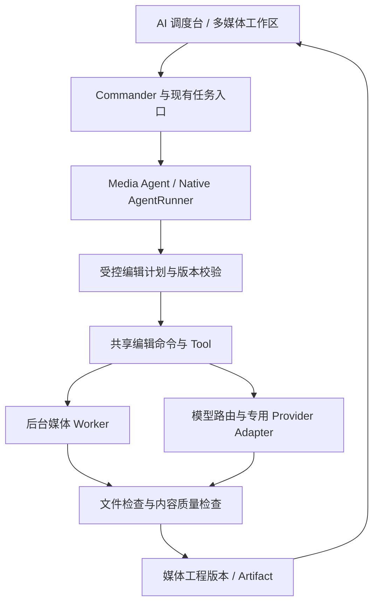

# AgentFlow 多媒体助手开发计划

> 版本：v0.9 | 建立日期：2026-09-16 | 最近更新：2026-09-21
>
> 状态：MM-0 的 G0（AI 模型准入）进行中。`qwen-image-3.0-pro` 已在固定公开夹具的换背景、局部移除、中文改字各 3 例完成开发者初检，并成为默认候选；Lite Matting 和 SAM 2.1 Tiny 已具备 CPU 运行及单样本 worker 生命周期证据。真实云端超时未知结果和调用方取消已留证，但独立质量复核、用量费用记录尚未完成，G0 未通过。本轮并行完成了不调用模型、不外发素材的 MM-1 图片工作区后端与 Qt 本地操作界面，并已在隔离实例走通导入、编辑、历史与导出主路径；它进入独立的 L1（本地工作区准入）后续夹具与 DPI 验收，不开放 AI 修图，也未完成正式发布准入。
>
> 配套文件：[评测与验证方案](MULTIMEDIA_AGENT_EVALUATION.md)。阶段、能力和验收编号在两份文档中共同维护。

## 1. 本次决策与执行范围

在现有 AgentFlow 内建设一个多媒体助手，暂定 `media_agent`，复用 Commander、Native AgentRunner、Workflow Runtime、SQLite、模型配置与任务历史。用户从自然语言提出需求，在可预览、可修改的工作区完成图片和音视频任务。

2026-09-16 用户同意将前一轮 GitHub 调研整合为开发计划与评测文档。2026-09-18 用户明确授权开始，并已在本地安全存储配置 Qwen Key；本轮只以程序生成的无客户内容测试图执行一次 Qwen Image 真实探针，不外发用户图片、不注册可执行 Agent。后续按本计划第一个未完成阶段推进；扩大产品范围、增加未授权费用或外发用户材料，仍按用户授权与现有权限策略处理。

| 决策 | 本计划采用的方案 |
| --- | --- |
| 主线顺序 | AI 修图 -> 对话式视频剪辑 -> 视频翻译与配音，逐个形成完整闭环 |
| 产品价值 | 用户可以连续修改结果、撤销、重新打开工程并导出成品；转码、抽帧、转写只是工具 |
| 首期用户 | 有照片编辑需求的个人用户、内容创作者和小团队，不限定电商、工业或 PPT 场景 |
| Agent 边界 | 先一个 `media_agent`，按图像、剪辑、翻译配音加载对应工具与上下文；ASR/TTS/分割属于工具或 Provider |
| 与既有 Agent 协作 | 多媒体助手独立完成媒体任务；文档、数据、知识库的组合调用放在单项能力通过验收之后 |
| 运行方式 | Windows 本地优先，云模型可选；重模型依赖按需准备，不增加默认启动下载或加载 |
| 成本属性 | 基础本地编辑与工程管理作为内置能力；外部模型用量和本地硬件需求明确展示，本计划不决定订阅定价 |
| 开工依据 | 模型相关功能先通过模型能力、接口、许可、资源与真实样本的 G0 选型门槛；纯本地工程可在 L1 轨道并行验收。不能用新增页面、工具数量或模型返回成功代替验收 |

## 2. 功能清单与取舍

### 2.1 三条正式规划主线

| 能力编号 | 功能 | 必须交付的用户体验 | 首次交付阶段 |
| --- | --- | --- | --- |
| IMG-01 | 图片工程与画布 | PNG/JPEG/WebP 导入、缩放平移、选择对象、前后对比、保存再打开、导出新文件 | MM-1 |
| IMG-02 | 确定性编辑 | 亮度/对比度/饱和度、裁剪、缩放、旋转；手动与 Agent 共享同一命令入口 | MM-1 |
| IMG-03 | 选区与局部 AI 编辑 | 笔刷/框选蒙版、局部消除、局部替换或换背景；明确“只修改哪里” | MM-2 |
| IMG-04 | 连续对话修图 | “上一版”“只改背景”“撤销刚才那步”绑定真实工程版本，不能靠聊天猜测 | MM-2 |
| IMG-05 | 最小图层与可逆历史 | 原始层、编辑结果层和蒙版引用；可见性、前后版本与撤销重做；不承诺 PSD 兼容 | MM-1/MM-2 |
| IMG-06 | 可靠图片交付 | 原图不覆盖、局部修改边界验证、图像回读、可从调度台预览与取回 | MM-3 |
| VID-01 | 视频工程与时间轴 | 本地视频导入、预览、字幕文本与源时间对应、片段边界和顺序可改 | MM-4 |
| VID-02 | 对话式剪辑 | 根据内容保留/删除段落、选择重录版本、组合片段；结果对应真实剪辑决策 | MM-5 |
| VID-03 | 字幕与导出 | 编辑字幕、导出 SRT 与 MP4，可选择是否烧录字幕；处理后字幕与新时间轴对齐 | MM-5 |
| VID-04 | 增量修改 | 改片段或字幕时只使相关结果失效，复用有效转写；重新打开工程可继续编辑 | MM-5 |
| LOC-01 | 视频翻译 | 首批中英双向翻译、术语表、数字与名称保留、原文/译文对照修改 | MM-6 |
| LOC-02 | 配音与时长对齐 | 选定合成声音、分段配音、试听和局部重配；保留环境声的能力单独声明 | MM-6 |
| LOC-03 | 多种交付合同 | 仅字幕、字幕视频、配音视频分别验收，用户要求配音时不能只交字幕却报全部成功 | MM-6 |
| LOC-04 | 模型与成本可控 | 翻译模型、ASR、TTS 独立配置，支持的语言和参数来自实际 Provider 能力 | MM-6 |

首期修图范围是 IMG-01 至 IMG-06。必须包含真实局部 AI 编辑与连续修改，不能只完成亮度调整便声称 AI 修图已交付。自动语义选区可在手工蒙版闭环后加入；复杂拆层、生成文字层、文生图和扩图可复用工程协议扩展，但不构成首期承诺。

### 2.2 保留的扩展方向

| 编号 | 候选方向 | 归属与价值 | 启动条件 |
| --- | --- | --- | --- |
| EXT-01 | AI 视频解说与成片 | 视频能力扩展：画面理解、解说脚本、配音、选段合成 | 剪辑和配音均通过验收；建立脚本与画面对应评测 |
| EXT-02 | 语言控制声音分离 | 音频工具：按文字、对象或时间范围保留/去掉目标声音 | 权重访问与许可明确；盲听证明分离效果及声音损伤可接受 |
| EXT-03 | 智能配音与声音设计 | 共享 TTS 能力：语气、角色、局部重配 | 基础 TTS 稳定后扩展；声音克隆须有明确授权来源 |
| EXT-04 | 资料转有声讲解/播客 | 文档/知识库与音频组合：脚本可审阅、来源可复核、音频可交付 | LOC 基础及文档证据链通过；不得捏造来源中的事实 |
| EXT-05 | 视频目标追踪与局部处理 | 视觉工具：目标持续打码、突出显示、分离或消除 | 跟踪丢失、遮挡、跨帧一致性及模型许可专项评测通过 |
| EXT-06 | 图片/文字生成视频 | 生成式 Provider：镜头生成与现有素材组合 | 算力/费用基线可接受，具备可预览和局部重生成流程 |
| EXT-07 | 实时语音与视觉互动 | 平台交互扩展：看画面、听用户说话、可打断会话 | 独立实时会话 ADR 与延迟/回声/打断验收；不塞入批处理 Runtime 冒充流式能力 |

扩展方向进入开发时，必须在两份文档中增加自己的阶段、夹具、预算、能力声明和通过记录。不能仅因依赖已安装，就自动开放全部模型功能。

## 3. 开源参考与使用边界

调研日期：2026-09-16。以下为仓库说明、目录与部分关键源码的静态调研，不是本机运行结论。MM-0 应为实际选中的依赖记录 commit/tag、代码许可、模型权重条款、下载来源和 Windows 验证结果。

| 参考项目 | 已观察到的结构/能力 | 在本项目中的用途 | 已知边界 |
| --- | --- | --- | --- |
| [ai-picture-editor](https://github.com/yuyuanweb/ai-picture-editor) | 修图工程、选区与图层、多工具计划；原 ai-retouch-agent 链接已重定向 | 参考统一编辑命令、画布上下文、计划校验与修订流程 | 教学项目；公开仓库未见明确 LICENSE，不能据公开可读推断可复制发布 |
| [video-use](https://github.com/browser-use/video-use) | 转写、按需时间轴图、剪辑决策、渲染与自评流程 | 参考按需读媒体、EDL 与有限修正 | coding-agent Skill 与 Python 工具组合；不是可直接嵌入 Qt 的编辑器，原流程有外部转写服务依赖 |
| [FunClip](https://github.com/modelscope/FunClip) | 按转写文本/说话人剪辑、字幕、LLM 辅助选段 | 参考中文语音定位和文本驱动剪辑 | ASR、依赖版本和时间戳须本机验证；不继承 README 的效果宣传 |
| [VideoLingo](https://github.com/Huanshere/VideoLingo) | 转写对齐、术语、翻译、字幕分段与配音 | 参考视频本地化任务分解和局部恢复 | ASR/TTS 依赖与支持语言分别核验，GPU/CPU 路线单独评估 |
| [NarratoAI](https://github.com/linyqh/NarratoAI) | 画面分析、解说生成、音频处理与视频导出 | EXT-01 流程参考 | 使用原仓库而非条款不同的 fork；当前根 LICENSE 为 MIT，模型/素材另核 |
| [SAM-Audio](https://github.com/facebookresearch/sam-audio) | 文本、视觉、时间提示的声音分离 | EXT-02 候选模型 | 权重需申请，GPU 推荐；底层模型不是 Agent |
| [Qwen3-TTS](https://github.com/QwenLM/Qwen3-TTS) | 语音生成、声音设计与可选克隆 | LOC/EXT-03 的 TTS 候选 | 各型号能力不同，不能把一种模型的能力套到所有型号 |
| [Open Notebook](https://github.com/lfnovo/open-notebook) | 多来源材料与多角色播客生成 | EXT-04 脚本到音频的流程参考 | 复用设计思路，不额外引入整套知识库和数据库 |
| [Grounded-SAM-2](https://github.com/IDEA-Research/Grounded-SAM-2) / [ProPainter](https://github.com/sczhou/ProPainter) | 提示定位、分割跟踪 / 视频修补 | EXT-05 候选工具组合 | 仍需自己建设 Agent 编排；ProPainter 明确限制非商业用途 |
| [Wan2.2](https://github.com/Wan-Video/Wan2.2) | 文生视频、图生视频等模型与推理代码 | EXT-06 候选 Provider | 显存和耗时取决于模型及参数，不能承诺普通 CPU 实时生成 |
| [Pipecat](https://github.com/pipecat-ai/pipecat) | 实时语音、多模态会话和多 Provider 管线 | EXT-07 实时架构参考 | 需要独立实时传输、打断和媒体时钟设计，不替换现有批任务所有权 |

[修图项目的 graph.py](https://github.com/yuyuanweb/ai-picture-editor/blob/main/backend/app/agent/graph.py) 展示了“规划 -> 校验”的分工，工具执行另由服务负责。AgentFlow 应保留自己的 AgentRunner 与权限链，不为复现框架名字迁移主运行时。

## 4. 与现有代码对齐

| 当前代码入口 | 可复用部分 | 本计划需要增加的部分 |
| --- | --- | --- |
| [agents/runner.py](../backend/app/agents/runner.py) | AgentDefinition、结构化 Tool、调用次数和输出修复上限 | 媒体 Agent 的 Definition、阶段工具集和最终交付 schema |
| [agents/registry.py](../backend/app/agents/registry.py) | manifest 发现与校验 | 完成注册前核对实际 action readiness，不能一开 Agent 就开放全部候选动作 |
| [workflow/node_contracts.py](../backend/app/workflow/node_contracts.py) | Agent/action 的输入输出、权限、失败码 | 修图、剪辑、翻译配音的最小 Node Contract |
| [workflow/runtime.py](../backend/app/workflow/runtime.py) / [runtime_jobs.py](../backend/app/workflow/runtime_jobs.py) | 任务生命周期、后台执行和恢复 | 受控媒体 worker、阶段检查点、取消与未知外部结果处理 |
| [database/sqlite.py](../backend/app/database/sqlite.py) / [task_repository.py](../backend/app/database/task_repository.py) | 前向迁移、任务、权限、checkpoint、artifact | 媒体资产与工程版本元数据；不另建一套任务状态数据库 |
| [services/model_gateway.py](../backend/app/services/model_gateway.py) | 文本调用、Tool Calling、Provider 和图像生成配置基础 | 当前 ModelConversationMessage 以字符串为主；补受控图像输入、媒体能力声明及专用模型适配 |
| [services/model_route_store.py](../backend/app/services/model_route_store.py) | 任务路由、用户覆盖、参数过滤 | 媒体规划、视觉理解、图片编辑、转写、翻译、配音的阶段配置 |
| [schemas/workflow.py](../backend/app/schemas/workflow.py) | 既有任务枚举、控制动作、产物类型 | 优先保持兼容；媒体 MIME/工程信息作为元数据，不随意扩展全局状态枚举 |
| [mainwindow.ui](../mainwindow.ui) | Qt Designer 布局、工作台导航、现有视觉体系 | 按阶段增加画布、片段/字幕编辑和预览；重处理不进入 UI 线程 |

## 5. 目标架构与数据契约

### 5.1 首期最小契约

以下名称与字段均为拟新增契约；以实现时的 Pydantic schema 为准，变更须同步评测。MM-1 只实现图片闭环必需字段，视频结构在 MM-4 增加，避免提前建设通用媒体平台。

| 契约 | 关键字段 | 约束 |
| --- | --- | --- |
| `MediaAsset v1` | asset_id、project_scope、content_hash、mime、metadata、parent_asset_ids | 原始文件受控保存，衍生产物保留来源；路径在服务端解析，模型只见 ID |
| `MediaProject v1` | project_id、project_scope、mode、revision、source_asset_ids、current_result | 与会话分离持久化，重启可打开；revision 单调递增 |
| `ImageRevision v1` | revision、parent_revision、canvas、layers、mask_refs、operation_refs | 蒙版绑定具体版本、坐标变换与层；变换后不能使用失效蒙版 |
| `MediaEditPlan v1` | plan_id、base_revision、goal、steps、requirements、budget、permission_ref | 步骤有类型化参数和依赖；批准绑定版本、计划摘要及外发范围 |
| `MediaOperation v1` | operation_id、tool_version、input_hashes、params、attempt、result_refs | 同一逻辑动作与不同 attempt 分开；工具结果不含无界二进制 |
| `MediaVerification v1` | requirement_id、check_id、status、evidence_refs、warnings | 文件有效、内容符合要求分别记录，未检查不能标通过 |
| `agentflow.delivery.v1` | status、headline、summary_markdown、facts、warnings、artifacts、next_actions | 沿用既有交付原则；结果和实际 artifact 一致，缺少必需结果不得报全部成功 |

编辑命令是模型与人工操作的共同入口。每次提交先校验 `base_revision`，执行结果提交前再次比较当前 revision；若用户已修改工程，旧结果只保留为候选，不能覆盖新版本。撤销通过保存的历史结果恢复，不重新调用模型；已发生的云端费用不能被撤销。

### 5.2 视频与音频的后续契约

| 契约 | 关键内容 | 约束 |
| --- | --- | --- |
| `Transcript v1` | 源素材、ASR 模型版本、语言、词/句段、起止时间 | 用户修正产生新版本；未知说话人保持匿名，不能推断真实身份 |
| `EditDecisionList v1` | clip_id、源 asset、source in/out、输出位置、音轨与字幕引用 | 使用半开区间和显式 time_base；以源 PTS 换算，不以帧号除标称 FPS 处理 VFR |
| `LocalizationProject v1` | 源字幕版本、译文、术语、voice profile、分段音频、对齐策略 | 修改译文使相应 TTS/混音失效，转写不因此全量重跑 |

EDL 采用整数 tick 与有理数 time_base 保存，UI 可显示秒。原音视频起始偏移、旋转元数据、重采样和代理视频到原素材的映射必须保留。首版精确裁剪走已验证的解码/重编码路径；不能把关键帧附近的 stream copy 当作任意时间点精确裁剪。

### 5.3 文件、缓存与恢复

- 媒体二进制、蒙版、缩略图、分段音频在受控文件区，SQLite 保存引用与元数据；不把视频或 base64 全文放进 checkpoint、消息归档或长期记忆。图片工作区的项目元数据已由 SQLite 中的 `media_workspace_projects` 作为唯一读取来源；原件、修订 PNG、矩形蒙版 PNG 和导出文件仍位于受控文件区，栅格图层保存来源素材/修订、位置和不透明度的冻结引用。v6 为异步编辑修订和导出记录分别保存 Runtime task 归属；启动恢复仅在对应 PNG 的哈希匹配且 Pillow 回读通过时补齐任务终态，无法验证则收束为失败，不会自动重跑。旧 JSON manifest 在首次访问时校验迁入 SQLite，并改名为不可读取的迁移留档。
- 缓存键至少包含源哈希、工程/蒙版版本、工具与模型版本、影响结果的参数。命中只是复用旧结果，不承诺生成模型可重现相同像素。
- 输出先写临时文件，回读后原子提交并登记 artifact；记录提交意图，在“文件已完成但数据库未登记”崩溃窗口进行对账，避免重复交付。当前图片工作区已对可捕获的 SQLite 写入异常执行补偿清理：创建、导入、修订和导出登记失败时移除本次新增文件；进程崩溃窗口的恢复对账仍需按 HARD-08 单独验证。
- 默认一个重计算 worker，限制队列、像素数、时长、临时磁盘和调用预算；并发提升必须有基准支持。CPU/GPU 工作不阻塞 FastAPI 事件循环。
- 提交接口快速返回持久化任务标识，进度沿现有 WebSocket/查询链读取；不让一个 HTTP 请求等待完整转码或生成。提交 request_id 去重，客户端断线重连和双击不能新建重复付费任务；任务时限按冻结 profile 覆盖各阶段，不能沿用短连接探针的超时。
- 本地 worker 取消后终止本任务子进程并释放句柄；外部任务取消若不被供应商支持，要明确远端可能继续计费，但禁止新提交和把迟到结果覆盖当前工程。
- Provider 已接收但客户端超时属于结果未知：优先按持久化 job/idempotency ID 查询；不可查询时停驻为 `provider_outcome_unknown` 错误，不盲目重发付费请求。
- Runtime 使用现有 paused/blocked/failed/cancelled 等状态；“结果未知”是错误原因而非偷偷新增全局枚举。部分交付在 delivery 和 requirements 中表达，不伪造 completed。
- 暂停在可保存边界生效，正在进行的不可中断步骤须明确说明；恢复跳过已验证阶段。源文件或工程版本改变时，列明失效步骤并创建新计划。
- 清理临时文件和缓存必须引用计数/有效引用检查；保留原件、当前版本和仍在保留期内的撤销材料。删除工程后不能留下可跨项目访问的缩略图、音频或索引。

## 6. 模型配置、工具与执行边界

| 拟新增路由 | 负责内容 | 准入条件 |
| --- | --- | --- |
| `media_planning` | 修图和剪辑意图、工具调用、有限修正 | Tool Calling/结构化输出可用，工具参数通过 schema |
| `media_vision` | 图片/选区理解、关键画面检查 | 已验证图像输入；有图像数量、尺寸和外发范围限制 |
| `media_image_edit` | 带源图和蒙版的编辑 | image_edit 能力明确；不得因为能文生图就假定能局部编辑 |
| `media_transcription` | 音频转写与时间戳 | 实际语言、时间戳粒度、输入时长和本地/远端能力可查询 |
| `media_translation` | 字幕翻译与术语约束 | 有结构化字幕段输出与长度预算 |
| `media_speech` | TTS/分段配音 | 选定声音、语言及支持参数可查询；未知能力不进入 UI |

模型与工具具体版本在 MM-0/MM-4/MM-6 的选型记录中冻结。配置继续归入现有模型管理：可选模型目录加手填、独立 Provider Key、参数能力过滤、本次任务覆盖、运行快照与实际用量。图片强度、ASR 语言、TTS 声音等使用专用字段，不生搬文本 temperature。显式选择的模型失败时不得静默替换或外发到其他服务。

### 6.1 预选模型矩阵与冻结规则

模型选型是功能可行性的前置条件，不是实现完成后的可替换细节。下表是当前建议的首选路线，不表示这些模型已经安装、接通或通过质量验收。MM-0/MM-4/MM-6 必须分别记录实际 Provider、模型 ID、版本、端点、权重来源、许可、硬件/费用档案与探针结果；任一项不通过则替换该能力路线，而不是在功能内部偷偷降级。

| 能力 Profile | 首选模型/路线 | 具体职责与不承担的职责 | 部署和选型理由 |
| --- | --- | --- | --- |
| `media_planning` | `Qwen / DashScope · qwen-plus`，以温度 `0` 输出受限 JSON 计划；Kimi 保留为尚未评测的候选 | 将自然语言请求转换为受限 `MediaEditPlan`，并做图片编辑提示词改写；不直接看图、修图、转写或生成媒体 | 已在 20 条冻结口语化意图上完成二轮真实探针：首轮 `19/20`，补齐澄清步骤字段规则后第二轮 `20/20`。该结论只覆盖 scope 和工具顺序，不把文本规划成绩外推到图片内容质量 |
| `media_image_edit` | `Qwen Image / DashScope · qwen-image-3.0-pro`，通过多模态生成 API 输入源图和编辑指令；`qwen-image-2.0-pro`、`qwen-image-edit-*` 仅保留为比较候选 | 局部消除、替换、换背景、文字/对象编辑；不能因模型能文生图就视为可控修图 | 在固定公开夹具上完成换背景、局部移除、中文数字改字各 3 次开发者初检，9 次本地合成的硬保护区均为 0 像素变化。原始模型输出仍会全图漂移，必须通过本地蒙版合成保护未选区域；独立复核、未知结果和费用/资源验收未完成，暂不开放给用户 |
| `media_matting` | 本地 `BiRefNet_lite-matting-epoch_110` 专用 Matting 权重，隔离 PyTorch CPU worker；`BiRefNet-general-bb_swin_v1_tiny` ONNX 已淘汰 | 正式目标是自动抠图与透明 alpha 蒙版，服务于“去背景/换背景”；不生成新像素、不替代局部编辑模型。专用 Matting 候选不承担“按文字只选某个物体”的语义选区 | 官方 v1 权重及源码已在 9 份公开样本（人像、商品、透明物体各 3）完成 CPU 探针，单图约 19–23 秒；单张高分辨率人像的加载峰值约 `2.64 GiB RSS`，只能作为单并发隔离后台 worker。输出仍待独立复核及交互修正验证，暂不注册到用户模型列表 |
| `media_segmentation` | 本地 `SAM 2.1 Hiera Tiny` 隔离 PyTorch worker；Small 仅在 Tiny 质量不达标时再评估 | 根据用户点选或框选产生二值对象蒙版；后续可复用于视频目标跟踪；不负责美化、补全画面或生成连续 alpha | 官方源码 Apache-2.0，已在 9 份公开样本完成固定框选+正点探针：首次编码约 1.82–2.11 秒、同图单次提示约 76–139 ms。另有一例复用同次图像编码和初始 logits 的正/负点交互记录。单张高分辨率人像峰值约 `1.02 GiB RSS`，也必须隔离运行。透明细小结构与质量独立复核仍未验证，不能准入 |
| `media_transcription` | 本地 FunASR `paraformer-zh` + VAD/标点；多语素材再单独评估 `Fun-ASR-MLT-Nano` | 输出中文转写及词/句时间戳，作为字幕、剪辑和翻译的唯一时间基线；不从无语音素材虚构文本 | FunASR 可返回时间戳，并可作为本地 OpenAI-compatible 识别服务运行。中文首期先固定一个模型，英文/多语路线不借用中文模型的效果声明 |
| `media_vision` | Provider 侧 `Qwen3-VL` 系列，按实际可用 API 的具体模型 ID 冻结 | 只在转写不足以判断画面时理解受控关键帧/短片段，例如确认产品画面或检查字幕遮挡；不作为整段视频逐帧盲读器 | 需要真实图像输入、结构化输出和视觉 token/费用限制。视频剪辑主线仍以时间戳转写为主，视觉模型按需调用，避免成本和上下文不可控 |
| `media_translation` | 复用 `Kimi / Moonshot · kimi-k2.6`，以独立翻译 Profile 执行 | 对已分段字幕翻译、遵守术语表与数字/人名保留规则；不改动源时间戳 | 与规划模型共用供应商不等于共用参数：翻译默认 temperature 0.1，要求严格段落 ID/JSON 返回，并以规则和人工抽检验收 |
| `media_speech` | 本地或独立服务方式接入 `Qwen3-TTS`；首期只开放预置声音 | 将已确认的译文分段合成为音频；不默认启用音色克隆、说话人模仿或口型同步 | 该系列支持稳定语音生成和流式输出。先验证中英声音、时长与可懂度；声音克隆仅在授权、模型能力和专项验收都满足后单独开放 |

`Seedream / 豆包` 保留在现有 `visual_generation` 路由中，用于 PPT 等文生图任务；它不是本计划的默认修图模型。只有在 MM-0 实测证明某个已配置端点同时支持图片输入、编辑结果回传、蒙版/局部编辑约束及失败查询后，才可将其登记为 `media_image_edit` 候选。此前出现过的生图服务繁忙也不能由其他供应商自动代偿。

`FFmpeg`、OpenCV、Pillow、Pandas 等是确定性工具而非模型；YOLO 仅在已有类别检测恰好适用时作为辅助，不代替通用选区模型。`RMBG-2.0` 虽是候选抠图模型，但其公开权重为非商业许可，当前不作为默认方案。文生视频、音频分离、视频修补和声音克隆均不在前三条主线的首发模型集合中。

不同 Profile 的配置字段必须分开：文本模型使用 temperature、最大输出和 JSON/Tool Calling；图片编辑使用输入图数量、尺寸、seed、推理步数及编辑强度等实际支持字段；ASR 使用语言、VAD、标点和时间戳粒度；TTS 使用声音、语速、采样率；分割/抠图使用权重、设备和阈值。UI 只显示当前模型真正支持的参数，不能在 ASR、SAM、BiRefNet 或 TTS 页面展示无意义的 temperature、Top P、存在惩罚或频率惩罚。

### 6.2 模型选型 POC 的阻断条件

在开发 MM-1 前，必须完成以下小样本探针并形成可回读记录：

1. `media_planning`：20 条图像任务意图中，受限计划 schema 解析和工具选择均正确的比例达到预设门槛；仅 JSON 可解析不算通过。
2. `media_image_edit`：同一组源图完成局部消除、换背景、中文文字编辑各至少 3 次；记录输入图、蒙版、模型 ID、参数、费用/耗时、返回图和失败原文。没有“源图输入 + 结果图”闭环的 Provider 立即淘汰。
3. `media_matting` 与 `media_segmentation`：在人像发丝、商品边缘、透明/细小对象和复杂背景夹具上分别检查 alpha 边缘、目标覆盖和用户修正次数；不能拿纯色背景样图代替。
4. 每一个本地模型：在目标 Windows 机器或 WSL worker 上完成冷启动、暖运行、取消、缺权重与 OOM 探针；每一个云模型：完成超时、Provider 返回错误、未知结果查询和用量记录探针。

MM-4 前追加 ASR 的中英文时间戳、长音频、无声和取消恢复探针；MM-6 前追加翻译术语、TTS 可懂度、分段时长与局部重配探针。未通过的 Profile 不注册到用户可选模型列表，也不显示为“可用”。

工具组随阶段开放：`media.inspect`、`image.adjust`、`image.select_region`、`image.edit_region`、`image.export`；随后增加 `media.transcribe`、`video.preview_edit`、`video.render`、`subtitle.translate`、`audio.synthesize`。这些是拟定名称，不是现有 API。最终名称需同时登记 Tool、Node Contract、能力目录和测试。

FFmpeg/Python 模型进程使用固定可执行文件和类型化参数，禁止模型拼接 Shell、Python 代码或任意 filter 表达式。本地首版不允许模型提供远程输入 URL；素材文字、字幕、EXIF 和音频内容均是待处理数据，不能变成系统指令。网络模型只接收用户批准的素材范围。

默认保留现有 AgentRunner 的有限工具调用与一次格式修复约束；质量修正首期最多一次，且受总预算约束。任何副作用许可不得由“模型建议再试一次”自动扩大。

### 6.3 MM-0 当前模型实测记录

| 项目 | 记录 |
| --- | --- |
| 探针时间与范围 | 2026-09-18；仅使用程序生成的 `1024 x 768` PNG，不读取或上传客户素材 |
| 实际 Provider / 模型 | `Qwen Image / DashScope` / `qwen-image-2.0-pro`；专用多模态生成端点，Key 由 `qwen_image` Profile 显式复用已加密保存的 Qwen 凭据 |
| 任务与交付 | 指令为“仅将中心红色圆形改为绿色，其他构图不变”；收到 1 张 PNG，尺寸 `1024 x 768`，本地下载后由 Pillow 回读成功，耗时约 `18 s` |
| 语义结果 | 中心采样色从 RGB `(228, 83, 76)` 变为 `(32, 149, 77)`；说明“原图 + 中文编辑指令 -> 可下载结果图”链路成立 |
| 保护区诊断 | 以中心圆外 `180 px` 区域作诊断，平均绝对像素差为 `4.499`，明显变化像素比例约 `1.99%`。模型未做到提示词意义上的像素级保留，不能作为 HARD-05 的蒙版保护证据 |
| 存档与结论 | 脱敏 manifest、输入和输出位于本机忽略目录 `data/media_evaluations/qwen_image_probe_20260918T020938Z/`；仅通过 Provider 连通性/语义编辑最小证明，`MODEL-02`、蒙版路线和 G0 仍未通过 |
| 图片规划探针 | `Qwen / DashScope · qwen-plus`，温度 `0`、最大输出 `640 tokens`；20 条冻结中文图片需求覆盖全局调整、局部修改和模糊需求澄清 |
| 规划实测结论 | 首轮记录 `media_planning_20260918T022215Z/` 为 `19/20`：MP-18 正确选择澄清但遗漏 `clarify.instruction`；保留该失败后补充契约提示，第二轮 `media_planning_20260918T022601Z/` 为 `20/20`，每条保留原始 JSON、解析计划、耗时和判定。只证明模型在固定意图集的计划选择正确，不代表任何图片已经编辑成功 |
| 本地前景蒙版探针 | 官方 `BiRefNet` GitHub Release `v1` 的 `BiRefNet-general-bb_swin_v1_tiny-epoch_232.onnx`，`224,005,088` bytes，SHA-256 `5600024376F572A557870A5EB0AFB1E5961636BEF4E1E22132025467D0F03333`；权重仅存放在忽略的 `data/media_model_cache/`，不随应用启动下载 |
| 前景蒙版实测结论 | 当前 Windows 的 `CPUExecutionProvider` 可加载固定 `1x3x1024x1024 -> 1x1x1024x1024` 契约。程序生成的 `960x640` 诊断图得到同尺寸 `L` alpha PNG，推理约 `13.4 s`，证据为 `data/media_evaluations/birefnet_foreground_mask_20260918T025138Z/`。该样本只证明本机执行和文件回读，明确不计入人物发丝、商品边缘、透明物体或任意对象分割质量成绩 |
| 公开样本复核 | 夹具集 `agentflow-mm0-public-image-fixtures-v1` 从 Wikimedia Commons 下载 1 张 CC0 发丝人像、1 张 CC BY-SA 4.0 商品场景和 1 张公共领域玻璃饮料图，许可证、来源和源哈希随本机 manifest 保存。Tiny CPU 实测为 `13,053 / 11,157 / 11,303 ms`，输出在 `data/media_evaluations/birefnet_public_fixtures_20260918T030044Z/` |
| 候选判定 | 人工查看 alpha：人像外轮廓可形成粗前景建议；商品图只选中显著碗/饮料，不能按用户指定任意商品；玻璃与液体的透明边缘被近似为不透明区域且有明显孔洞。该权重不通过正式 `media_matting` 或 `media_segmentation` 路线筛选，不注册到模型列表；后续仅在获得明确产品需求时评估专用 Matting worker |
| Lite Matting CPU 探针 | 官方 BiRefNet Release `v1` 的 `BiRefNet_lite-matting-epoch_110.pth`，`88,931,642` bytes，SHA-256 `30D504B91664E42387F8980E5EFC6927C26E67733C0E7278D03E91C5C65182C3`。权重与 `swin_v1_t` 配置严格匹配（586 键、无缺失/多余/形状不一致），在独立 `torch 2.6.0+cpu` worker 中运行，不引入主后端依赖 |
| Lite Matting 首轮结果 | 同一公开夹具集的三张来源哈希已校验样本，分别输出可回读的 `L` alpha 与 RGBA 抠图：发丝人像 `18,408.586 ms`、商品场景 `19,676.908 ms`、透明玻璃饮料 `20,711.838 ms`。初步人工查看显示发丝保留、餐具/饮料分离和玻璃杯/液体的连续透明边缘均显著优于 Tiny；证据为 `data/media_evaluations/birefnet_lite_matting_20260918T063431Z/` |
| Lite Matting 扩展结果 | v2 夹具的 9 张来源哈希已逐张校验并全部输出可回读 alpha/RGBA：人像、商品、透明物体各 3 张，耗时范围 `19,429.817–23,383.036 ms`，三类均值为 `21,293.776 / 22,850.577 / 22,315.679 ms`。证据为 `data/media_evaluations/birefnet_lite_matting_20260918T072222Z/`；manifest 对每张明确标为 `pending_human_review`，不把运行成功写成质量通过 |
| Lite Matting 独立评审包 | 离线脚本逐项校验九张 v2 源图哈希、Lite 模型 ID、alpha 路径与尺寸后，生成原图 / alpha / 棋盘边缘预览卡和待填写 `review.csv`；v2 包位于 `lite_matting_review_packet_20260920T034155Z/`，manifest 冻结卡片、源图和 alpha 哈希。只读校验器确认卡片未替换、CSV 对应九例，但九行仍为空；它不加载模型、不联网且不作质量结论 |
| Lite Matting 限制与状态 | 该模型输出自动显著前景，商品场景会同时选中相邻物体，不能实现“只选杯子”等任意对象选区，因此不充当 `media_segmentation`。样本数量已达三样本/类别，但独立复核、冷启动、取消、缺权重/OOM 与资源上限仍未完成；保留为 `media_matting` 候选，`MODEL-03` 与 G0 仍未通过 |
| SAM 2.1 Tiny CPU 探针 | 官方 `facebookresearch/sam2` 源码 commit `2b90b9f5ceec907a1c18123530e92e794ad901a4`（Apache-2.0）与 `sam2.1_hiera_tiny.pt`；权重 `156,008,466` bytes，SHA-256 `7402E0D864FA82708A20FBD15BC84245C2F26DFF0EB43A4B5B93452DEB34BE69`，`38,962,498` 参数，独立 CPU worker 加载约 `1.1 s` |
| SAM 2.1 Tiny 首轮结果 | 对同一公开夹具以预冻结的“框选 + 正点”提示输出可回读二值蒙版和 RGBA 预览。人像、商品饮料、透明玻璃的首次编码分别为 `1,982.665 / 2,057.251 / 1,888.422 ms`，同图提示解码为 `126.134 / 80.564 / 96.649 ms`；人工复核显示商品饮料被单独选中，透明玻璃完整被选中。证据为 `data/media_evaluations/sam2_hiera_tiny_20260918T065101Z/` |
| SAM 2.1 Tiny 扩展结果 | v2 夹具的 9 张来源哈希已逐张校验并全部输出可回读二值蒙版/RGBA 预览。固定“框选 + 正点”下，首次编码范围 `1,824.777–2,110.112 ms`，单次提示解码范围 `75.912–138.784 ms`；人像、商品、透明物体的编码均值为 `2,050.290 / 1,960.981 / 1,905.085 ms`，提示均值为 `106.278 / 88.270 / 92.867 ms`。证据为 `data/media_evaluations/sam2_hiera_tiny_20260918T072639Z/`，模型内部预测分数范围 `0.8769–0.9776` 不作为质量成绩 |
| SAM 2.1 Tiny 独立评审包 | 同一离线评审脚本校验 v2 来源、SAM 模型 ID、九张二值 mask 及尺寸，生成原图 / mask / 棋盘边缘预览卡和待填写 CSV；v2 包位于 `sam2_selection_review_packet_20260920T034156Z/`，manifest 冻结卡片、源图和 mask 哈希。校验器确认卡片未替换、CSV 对应九例但未填结论；它会直接展示“选中的是哪个对象、有哪些背景泄漏或透明细节缺失”，不以内部 `best_iou_score` 代替人的质量结论 |
| SAM 2.1 Tiny 交互探针 | 在 `MM0-PRODUCT-02` 相机图中，先以冻结框和正点生成初始 mask，再复用同一图像编码和初始 logits，追加一个位于白色背景的负点。编码仅 1 次（`3,467.403 ms`），初始/第二轮提示为 `178.855 / 141.870 ms`，蒙版变化 `10,765` 像素，产物均通过回读；证据为 `data/media_evaluations/sam2_interaction_20260920T021753Z/`。负点本身在修改前后均未被选中，变化主要在边缘，因此只证明多轮提示链路，不作为“误选已修正”或质量通过证据 |
| SAM 2.1 Tiny 有效负点矩阵 | 人像 `MM0-PERSON-01`、商品 `MM0-PRODUCT-01`、透明物体 `MM0-TRANSPARENT-01` 分别以首轮选区内部的冻结负点修正，并复用首轮 logits。三例均只编码一次，负点均从已选变为未选，蒙版变化 `73,050 / 28,795 / 868,601` 像素；编码 `3,075.005 / 1,899.595 / 1,804.182 ms`，二次提示 `70.087 / 75.732 / 69.839 ms`。证据为 `sam2_negative_point_matrix_20260920T031920Z/`。它证明有效负点能驱动同一编码内的选区变化，不证明边界、人像发丝或透明物体质量 |
| SAM 2.1 Tiny 限制与状态 | 预测分数是模型内部估计，不是人工 IoU；人像轮廓不等于发丝 Alpha，透明物体也仅输出二值选区。三类有效负点的运行证据已补齐，但仍缺人类对“变化是否符合意图”的独立质量复核、复杂背景和视频传播探针。仅保留为 `media_segmentation` 候选，`MODEL-03` 与 G0 仍未通过 |
| 本地 worker 生命周期探针 | `probe_local_media_worker_resilience.py` 使用 v2 公开夹具中的 `MM0-PERSON-01`，从主后端虚拟环境监督隔离 PyTorch worker，但不在主进程导入模型。Lite Matting：模型加载 `37,394.204 ms`、首次/同进程第二次推理 `12,259.163 / 14,905.433 ms`、峰值 RSS `2,835,820,544 bytes`（约 `2.64 GiB`）；SAM Tiny：`6,528.623 ms`、`2,821.432 / 1,808.383 ms`、`1,092,730,880 bytes`（约 `1.02 GiB`）。Lite 暖运行在该单例反而更慢，不能据此承诺加速。证据为 `data/media_evaluations/local_media_worker_resilience_20260920T020649Z/` |
| 本地 worker 失败与取消 | 两个 worker 的缺权重均在创建输出目录前失败（Lite `534.713 ms`、SAM `291.489 ms`）；结果已生成但尚未写入 artifact 的测试暂停点被父进程终止后，均以非零退出且无 PNG/manifest 提交。终止时 Lite/SAM 峰值 RSS 分别为约 `2.63 GiB / 0.95 GiB`，监督后无残留 Python 进程。该证据仅覆盖隔离进程的强制终止和提交前原子边界，不等价于正式 Runtime 的协作取消或推理内中断；后者仍由 MM-3 实现并验收 |
| Qwen 2.0 对照结果 | `qwen-image-2.0-pro` 的 9 个固定样本首次批量运行中，已完成的 4 个请求后出现 5 次 `HTTP 429 / Throttling.RateQuota`；以 `35 s` 间隔只恢复失败样本后全部回读。开发者复核显示换背景和中文改字可用，但 3 个局部移除出现残留或补全不自然，不作为默认候选。证据为 `qwen_image_quality_20260918T073802Z/` 与 `qwen_image_quality_20260918T074143Z/` |
| Qwen Edit Max 对照结果 | `qwen-image-edit-max` 的 3 个局部移除调用均返回 PNG；玻璃杯移除可接受，但贴纸案例曾因本地羽化蒙版边界把原红色边缘混回结果。探针已修复为对贴纸选区预扩张 `24 px`，并提供零网络重合成，仍观察到一例局部补全背景不自然。该模型不设为默认候选；其实际并发/成本策略留待 `MODEL-04` 与 Provider 用量记录完成后冻结 |
| Qwen 3.0 Pro 公开夹具初检 | `qwen-image-3.0-pro` 使用相同 v2 夹具完成 9 次真实调用：换背景、局部移除、中文改字各 3 次；耗时 `21.023–33.507 s`，均值 `25.776 s`，本地合成后的硬保护区均为 0 个变更像素。开发者复核中三例移除与三例数字改字均完成目标；三例换背景完成背景替换，第二例的 Lite Matting 硬保护像素仅 `7,021`，不能把该像素检查外推为整个人物完全不变。证据为 `qwen_image_quality_20260918T080123Z/`（第 6 例）及 `qwen_image_quality_20260918T080307Z/`（其余 8 例） |
| Qwen 3.0 Pro 独立评审包 | 脚本从上述两批原始 manifest 严格收集恰好 9 个 `QWEN-REAL-01..09`，逐项重新核验源图哈希、模型 ID、结果图和编辑范围，再生成“原图 / 实际结果 / 编辑范围”对照卡与 `review.csv`。v2 包位于 `data/media_evaluations/qwen_image_review_packet_20260920T034154Z/`，manifest 冻结每张卡和输入的哈希；只读校验器确认卡片未替换、CSV 对应九例但均未填写。下一位非实现者应直接查看卡片并填 CSV，未填前不改变候选或 G0 状态 |
| Provider 失败语义 | 适配器将 `400` 等明确 4xx 标为 `rejected`，将 `429` 标为可受预算约束等待的 `QwenImageEditRateLimitError`（读取简单秒数 `Retry-After`）；提交超时、连接中断、`408` 与 5xx 标为 `QwenImageEditOutcomeUnknownError`，明确禁止自动重发；调用方取消原样传播。MockTransport 已覆盖 `400 / 429 / 503 / 超时 / 连接中断 / 取消`，但真实云端只留有历史 `429` 与 `400` 证据，不能将离线契约称为真实故障验收 |
| Qwen 真实超时与取消 | `probe_qwen_image_unknown_outcome.py --execute` 对内存生成的 `512x512` PNG 仅提交一次 `qwen-image-3.0-pro` 请求，客户端等待阈值 `1 s`，约 `3.289 s` 后得到 `request_timeout / unknown`；适配器将 `safe_to_retry_automatically=false`，未下载结果、未重发、未落盘输入图。第二次独立合成图请求在 `1 s` 后由调用方取消，约 `2.673 s` 后以 `cancelled` 返回，同样不下载或重发。证据为 `qwen_image_unknown_outcome_20260920T030712Z/` 和 `qwen_image_unknown_outcome_20260920T030953Z/`。两次 Provider 是否已接受、生成或计费均不可查询，因此费用明确记录为 unknown，而不是 0 |
| Qwen 3.0 usage 记录 | 修正适配器仅识别旧 `image_count/width/height` 的缺陷，兼容 Qwen 3.0 的输入/输出数量、档位和尺寸字段，且正文无 ID 时读取 `x-request-id`。一条真实 `1024x768` 合成编辑请求回传 request ID、输入/输出各 1、`qima_input_1k/qima_output_1k`、`1024x768`，结果下载并回读；证据为 `qwen_image_probe_20260920T032540Z/`。Provider response usage 以 request ID 关联保存，但不等同于逐请求已出账金额；历史九例受旧适配器限制没有 usage，不能追填 |
| 当前选择与未完成项 | 因 Qwen 3.0 Pro 是当前唯一覆盖三类各 3 例且通过开发者初检的模型，代码默认候选改为 `qwen-image-3.0-pro`；这不是对用户开放，也不是 `MODEL-02` 或 G0 通过。独立评审材料已齐备但尚无非实现者结论；成功调用现可记录 request ID 与 Provider usage，历史九例仍缺逐例 usage，实际费用尚待供应商延迟监控/账单核对。`qwen-image-agentflow-invalid-model-probe` 的 `HTTP 400 / InvalidParameter / Model not exist` 失败证据仍保留于 `qwen_image_failure_20260918T061713Z/` |

为避免历史误配置，普通 `Qwen / DashScope` 文本 Provider 已在保存、路由及运行时三层拒绝 `qwen-image-*` 模型；图片模型只能使用 `Qwen Image / DashScope` 的专用协议。该限制不阻止后续新增 Wan 等独立能力 Profile，但未经端点、参数和质量探针验证前不得混入本路线。

## 7. 工作区与用户流程

沿用 [Qt 前端设计基线](前端设计可借鉴文档.md)，不迁移 React/Electron 或复制外部项目的前端技术栈。

| 区域 | 图片阶段 | 视频/翻译阶段 |
| --- | --- | --- |
| 主区 | 画布、缩放、选区、原图/结果比较 | 播放器、片段范围、源/结果比较 |
| 对象区 | 当前素材、图层、版本 | 素材、片段、字幕段、译文 |
| 命令区 | 自然语言、当前选区和模型状态 | 自然语言、当前片段/字幕选择 |
| 属性区 | 与当前工具相关的少量参数，可折叠 | 边界、字幕、导出与配音参数，可折叠 |
| 交付区 | 已验证图片、工程入口、继续修改 | 字幕、视频、音频与工程入口 |

操作顺序：明确素材与目标 -> 生成受控计划/编辑预览 -> 按当前授权执行 -> 展示真实处理状态 -> 预览结果与问题 -> 修改/撤销/导出。确定性本地预览不应每次弹窗；外发素材、付费生成和正式输出按作用域授权，批准后在同一任务中继续。调度台能完成的任务在原会话交付，专业工作区用于精修。

当前并行实现的 MM-1 界面入口为“视觉工作室 -> 打开图片工作区”。它已经支持项目创建、JPEG/PNG/WebP 受控导入、素材与版本列表、版本预览、旋转/镜像/灰度、亮度/对比度/饱和度调整、像素裁剪、高质量缩放、矩形透明蒙版和栅格图层叠加；每个操作都生成不可覆盖的 PNG 修订，参数随修订保存并在版本列表中可查。裁剪和蒙版页提供画布拖拽框选，画布按当前显示比例映射回原图像素坐标，并与数值控件双向同步。蒙版采用像素坐标生成版本绑定的二值 PNG；图层可从同一项目选择另一张素材，指定位置和不透明度后固定其来源修订并合成为新版本。组合修订保存完整图层栈快照，图层页可显示当前版本的图层、切换可见性并上下重排；每次调整都会从冻结底图和来源版本重渲染一份新的 PNG 修订。确定性编辑和 PNG 导出都会先受理为统一 Runtime 任务，创建/回读后的修订或交付物、步骤、工具调用、终态事件均可回查；窗口轮询已验证终态后才刷新修订链或以 `QSaveFile` 写入用户选定位置。撤销/重做只移动经过文件哈希回读的当前版本指针，不重算、不删除版本；撤销后产生新编辑会按项目记录清空重做分支。编辑与撤销/重做请求必须携带用户发起操作时看到的 `base_revision_id`，后端在项目写锁内比对当前版本，迟到或并发的旧请求返回 HTTP `409`，不会改写新的当前版本。客户端只将所选文件的名称和字节交给本机 API，后端不接收客户端绝对路径；编辑只能针对当前版本提交，历史版本仅用于查看和导出，避免错误地把旧版本当作编辑父版本。此界面尚无缩放平移、前后对比、自由变换/文本图层、自然语言编辑或云模型调用。

在 1280x720、1366x768、1920x1080 和 100%/150%/200% 缩放组合中验证有效布局，狭窄时折叠属性区；不能依赖用户手动拉大弹窗才能点到按钮。图标按钮有名称提示；数值使用原生可见步进按钮/滑块；状态不只靠颜色。

## 8. 分阶段开发与出口

所有阶段状态初始为“未开始”。阶段内先离线协议和本地工具，再受控真实模型，最后客户端完整任务；不得把最后一步永久留给用户自行测试。

| 阶段 | 前置 | 必须完成的工作与交付件 | 验收出口 | 当前状态 |
| --- | --- | --- | --- | --- |
| MM-0 选型与基线 | 本计划 | 固定首期 IMG 范围；依赖/许可/Windows 矩阵；源素材与评测清单；CPU/可选 GPU/远端档案；图像编辑 Provider 小样本验证；冻结费用和质量门槛 | G0：选定可执行图片路线，基线和夹具版本可复查 | 进行中：`media_planning` 已通过固定意图集；Qwen、Lite Matting 和 SAM 均已生成待非实现者填写的 v2 九例独立评审包，卡片和表格可由只读校验器验真；真实 Qwen 成功请求的 usage/request ID、超时未知结果和调用方取消均已留证。BiRefNet Tiny 已淘汰；Lite/SAM 已完成每类 3 张 CPU 运行和单样本生命周期证据，SAM 另有三类有效负点修正记录。仍待独立质量、历史九例 usage 和供应商费用核对 |
| MM-1 图片最小工程 | 无模型前置，可与 MM-0 并行 | IMG-01/02/05：受控导入、版本、最小图层、蒙版、手动命令、保存/打开/导出；临时数据库迁移验证 | L1：本地工程与确定性图像操作 required 全通过 | 本地实现与自动化回归已完成：受控导入、不可覆盖修订、蒙版、图层栈、撤销/重做、导出、Runtime 审计和重启对账均有实现及回归。隔离 Qt 实例已真实完成创建项目、导入、右转、撤销、重做和 PNG 导出，详见[评测记录 10.2](MULTIMEDIA_AGENT_EVALUATION.md#102-l1-隔离-qt-主路径记录2026-09-21)；剩余为 L1 全量夹具、真实 Windows DPI 流程与人工边界复核。L1 通过不代表 AI 修图开放。 |
| MM-2 AI 修图闭环 | `L1 + G0` | IMG-03/04：模型适配、工具计划、多轮编辑、局部消除/替换、结果预览、有限修正；工作区与调度台共用执行 | G2：离线规划、真实图片编辑、选区保护和版本冲突验收通过 | 未开始 |
| MM-3 图片发布准入 | G2 | IMG-06：取消/恢复/未知结果、预算、错误表达、Qt 全流程、原功能回归、依赖缺失行为和完整证据包 | G3：图片能力可对用户开放；其余模式保持不可调度 | 未开始 |
| MM-4 视频基础与选型 | G3 | 在现有资产上增加 PTS/音轨/代理映射、播放器、ASR 与 EDL；冻结 VID/LOC 视频夹具及性能档案 | G4：视频本地工具与转写时间轴验证通过 | 未开始 |
| MM-5 对话式剪辑 | G4 | VID-01 至 VID-04：按内容剪辑、人工边界修正、字幕编辑、精确导出、重启继续、调度台交付 | G5：语义选段、音画同步、EDL 与导出一致性、客户体验全部通过 | 未开始 |
| MM-6 翻译与配音 | G5 | LOC-01 至 LOC-04：中英翻译、术语、TTS、时长处理、局部重配、真实供应商失败降级与交付合同 | G6：字幕和配音分别通过质量、时间轴、成本及恢复验收 | 未开始 |
| MM-7 整合与发行验证 | G6 | 文档/知识库受控素材协作，三模式能力声明一致，Windows 目录候选、升级与原功能回归 | G7：三条主线联合验收；实测范围内可对外描述 | 未开始 |
| MM-X 可选扩展 | 对应基础阶段通过 | 对 EXT 编号单独立项、固定夹具/预算、验证工具与用户闭环 | GX：逐项验收，不以一个实验成功开放全部扩展 | 未开始 |

### 8.1 首批输入规模建议

MM-0/MM-4 可根据测量下调，变更要在正式评测前冻结，不得测试失败后悄悄扩大容错或缩小统计分母。

| 模式 | 初始产品范围建议 | 超出范围的行为 |
| --- | --- | --- |
| 图片 | PNG/JPEG/WebP；当前后端单图不超过 4000 万像素/20 MB，单个工程首批不超过 8 个素材 | 导入前说明限制；可生成明确标记的预览代理，不静默降低最终导出尺寸 |
| 视频 | 本地 MP4，首批 H.264/AAC，720p/1080p；单源不超过 20 分钟/2 GB，单工程最多 3 个源 | 明确不支持的编码/容器；源有 VFR 时正确映射或显式拒绝，不能输出错位结果 |
| 配音 | 中英双向，单批最多 10 分钟；先单一合成声音 | 其他语言/声音能力依据 Provider；不把基础配音宣传为音色克隆或口型同步 |

### 8.2 每阶段交付记录

| 必填项 | 要求 |
| --- | --- |
| 范围 | 本次阶段、需求编号、实际开放 action；未完成项明示 |
| 代码与依赖 | 当前 commit、依赖/模型版本、输入与配置哈希 |
| 验证 | 对应 G 编号、required/diagnostic 分类、原始分子分母、报告位置 |
| 费用与资源 | 本地耗时/资源、真实请求数、Provider 用量、已知费用或未知原因 |
| 失败与回退 | 失败类别、影响对象、已保存结果、下一次从哪里继续 |
| 状态同步 | 更新本阶段状态、配套评测记录、PROJECT_STATUS；仅已通过的能力进入对外功能描述 |

后续分为两条独立主线：G0 继续由非实现者填写已生成的 Qwen 3.0 Pro、Lite Matting 和 SAM Tiny v2 九例评审包，并用 `verify_media_review_packet.py --require-complete` 固定填写后的证据状态；待 Provider 监控窗口开放后按时间、模型、request ID/输出档位核对费用，并决定是否为历史九例重新采集 usage。L1 则只补 Qt 工作区的真实素材操作、导出回读与 100%/150%/200% DPI 证据，完成后可单独宣布本地图片工程通过。两条线均未通过前不得开放 AI 修图；MM-2 必须等待 `L1 + G0`。BiRefNet Tiny 已完成 CPU 筛选但不通过正式能力标准；`media_planning` 已有固定意图集通过记录。
