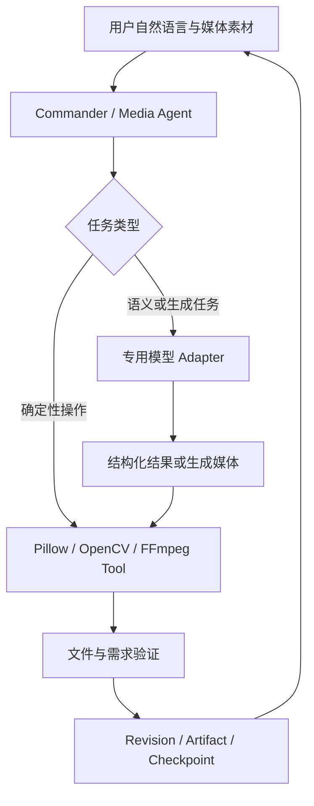

# AgentFlow 多媒体助手开发计划

> 版本：v1.0 | 建立日期：2026-09-16 | 最近更新：2026-09-23
>
> 当前结论：多媒体助手采用“模型负责理解与生成、成熟媒体工具负责精确执行、AgentFlow 负责调度与可靠交付”的路线。现有图片工作区保留为工程底座并停止横向扩建；下一开发任务是接通真实 AI 修图纵向闭环，而不是继续建设通用图片编辑器。
>
> 当前门槛：`G0-DEV`（图片模型内部开发准入）和 `L1-DEV`（最薄媒体底座开发准入）已满足；`G2`（AI 修图质量准入）和 `G3`（用户发布准入）尚未通过。配套评测见[多媒体助手评测与验证方案](MULTIMEDIA_AGENT_EVALUATION.md)。

## 1. 产品定位与纠偏结论

在现有 AgentFlow 内建设一个 `media_agent`，让用户通过自然语言完成 AI 修图、对话式视频剪辑、视频翻译与配音，并得到可以预览、继续修改和下载的真实文件。

本项目不是 Photoshop、Premiere 或剪映的替代品，也不自行训练图片生成、ASR、翻译或 TTS 模型。基础裁剪、转码、混音等能力只作为模型任务的执行工具，不单独包装成主要卖点。

### 1.1 三层职责

| 层级 | 负责什么 | 不负责什么 |
| --- | --- | --- |
| 模型层 | 理解自然语言和素材；生成或修改图像；转写、翻译、配音；生成结构化剪辑决策 | 不直接承担文件版本、权限、恢复、精确编解码和最终交付状态 |
| 媒体工具层 | 使用 Pillow/OpenCV/FFmpeg 等执行精确裁剪、缩放、合成、转码、字幕封装、混音和文件回读 | 不判断用户语义，不自行扩展为完整编辑器 |
| AgentFlow 层 | 模型路由、Tool 调用、任务状态、版本、撤销、预算、权限、失败恢复、Artifact 和交付验证 | 不重写成熟算法、编解码器或第三方模型 |

### 1.2 什么时候直接调用模型

- 需要理解画面、生成内容或进行语义修改时，默认直接调用对应专用模型，例如消除物体、换背景、语音转写、字幕翻译和语音合成。
- 只有多步骤、存在高风险写入或需要用户确认时，才让规划模型先生成结构化计划；不为单一模型调用增加无价值的 Agent 循环。
- 精确尺寸、格式转换、时间轴、局部合成和导出由确定性工具处理，不能只靠提示词保证。
- Provider 如果已经提供成熟的结构化编辑任务，优先通过 Adapter 接入，不在 AgentFlow 内重复实现。

### 1.3 明确不做

- 不继续建设完整图层系统、画笔引擎、自由变换、滤镜商城或 PSD 兼容。
- 不建设完整多轨时间线、特效面板和专业调色界面。
- 不自行实现图像编解码、视频编解码、ASR、机器翻译、TTS 或声音克隆模型。
- 不把模型探针、手工工具数量或 UI 页面数量当作产品进度。
- 不要求所有候选模型全部通过后才开始纵向闭环；只有被当前路线实际依赖的能力才构成前置门槛。

## 2. 功能范围

### 2.1 正式主线

| 编号 | 能力 | 角色 | 首次交付 |
| --- | --- | --- | --- |
| IMG-01 | 素材受控导入、原件保护、版本和导出 | 支撑能力，复用现有实现 | MM-1 |
| IMG-02 | 裁剪、缩放、旋转、格式转换和局部合成 | 确定性 Tool，不作为 AI 卖点 | MM-1 |
| IMG-03 | 根据源图、提示词和可选蒙版执行真实 AI 编辑 | 图片主能力 | MM-2 |
| IMG-04 | 基于真实 revision 进行“上一版”“只改背景”等连续修改 | 图片主能力 | MM-2 |
| IMG-05 | 最小历史、撤销重做和候选结果保留 | 支撑能力；不扩展完整编辑器 | MM-1/MM-2 |
| IMG-06 | 结果回读、来源、费用、失败说明与 Artifact 交付 | 图片主能力 | MM-3 |
| VID-01 | ASR 生成带时间戳转写，必要时由 VLM 补充画面理解 | 视频基础 | MM-4 |
| VID-02 | LLM 根据用户要求生成可校验 EDL，而不是直接“生成视频” | 视频主能力 | MM-5 |
| VID-03 | FFmpeg 按 EDL 精确剪辑、处理字幕并导出 MP4/SRT | 确定性执行 | MM-5 |
| VID-04 | 修改片段或字幕时仅使相关缓存失效 | 视频主能力 | MM-5 |
| LOC-01 | 基于转写分段进行中英翻译、术语和专名约束 | 本地化主能力 | MM-6 |
| LOC-02 | TTS 分段配音、试听和局部重配 | 本地化主能力 | MM-6 |
| LOC-03 | FFmpeg 执行时长适配、混音和字幕/配音视频封装 | 确定性执行 | MM-6 |
| LOC-04 | ASR、翻译、TTS 独立配置并记录实际能力和用量 | 模型治理 | MM-6 |

首期只交付 IMG-01 至 IMG-06。IMG-01/02/05 已经形成的工程能力作为底座冻结维护；MM-2 不以新增本地编辑按钮为目标。

### 2.2 可选增强

自动抠图、任意对象分割、视频目标追踪、声音分离、声音克隆、文生视频和实时多模态会话都属于独立增强。只有主线通过对应发布门槛，并且增强能力有明确用户任务、模型许可、资源预算和评测集时，才单独立项。

Lite Matting 和 SAM 2.1 Tiny 当前只是可选工具候选。手工蒙版或图片编辑模型本身已能支持首个 AI 修图闭环时，它们不阻塞 MM-2。

## 3. 目标架构



典型路径：

```text
AI 修图：图片 + 提示词 + 可选蒙版 -> 图片编辑模型 -> 局部合成/格式处理 -> 新 revision
视频剪辑：视频 -> ASR/VLM -> LLM 生成 EDL -> FFmpeg 渲染 -> MP4/SRT
翻译配音：视频 -> ASR -> 翻译模型 -> TTS -> 对齐/混音/封装 -> 配音视频
```

模型输出必须先转为 Pydantic 契约或受控媒体文件，不能让自由文本直接拼接 Shell/FFmpeg 参数。

## 4. 模型与工具选型

| 路由 | 当前用途 | 开发前最低要求 | 是否阻塞当前阶段 |
| --- | --- | --- | --- |
| `media_planning` | 多步骤意图转结构化 Tool/参数 | 结构化输出和固定意图集可用 | 阻塞 MM-2；当前已满足 |
| `media_image_edit` | 源图编辑、局部消除、换背景和改字 | 支持真实图片输入；固定样本可回读；失败语义明确 | 阻塞 MM-2；当前候选为 `qwen-image-3.0-pro`，已满足内部开发准入 |
| `media_vision` | 画面理解或结果辅助检查 | 只有任务确实需要看图时才接入 | 不阻塞首个修图闭环 |
| `media_segmentation` | 自动生成对象蒙版 | 对象选择质量和资源可接受 | 可选，SAM 不阻塞 MM-2 |
| `media_matting` | 发丝、半透明边缘 alpha | 抠图质量和资源可接受 | 可选，Lite Matting 不阻塞 MM-2 |
| `media_transcription` | 带时间戳转写 | 语言、时间戳粒度和时长限制可验证 | 阻塞 MM-4 |
| `media_translation` | 字幕翻译 | 结构化字幕段、术语和专名可约束 | 阻塞 MM-6 |
| `media_speech` | 分段 TTS | 声音、语言、时长和使用条款明确 | 阻塞 MM-6 |

模型名称和 Provider 只存在于 ModelGateway/Profile/Adapter，不能写死在 Agent、Workflow 或 UI 业务逻辑中。用户可在模型管理中选择兼容模型，系统依据真实能力过滤参数，不因模型名称推测它支持图片编辑、音频或视频。

确定性工具优先采用成熟依赖：

- 图片：Pillow 为首期执行与回读工具；OpenCV 仅在确有算法需求时引入。
- 视频和音频：FFmpeg/ffprobe 负责解码、裁剪、转码、字幕、混音和媒体探测。
- AgentFlow 只维护类型化参数、进程隔离、资源限制、产物验证和恢复边界。

## 5. 最小工程契约

| 契约 | 必需内容 | 边界 |
| --- | --- | --- |
| `MediaAsset v1` | asset_id、project_scope、hash、MIME、metadata | 服务端解析路径；模型只得到受控字节或临时引用 |
| `MediaProject v1` | project_id、mode、revision、source_asset_ids、current_result | 与聊天会话分离，可重启打开 |
| `ImageRevision v1` | revision、parent_revision、result_asset、operation_ref | 每次模型或工具执行产生新版本，不覆盖原图 |
| `MediaEditRequest v1` | goal、base_revision、optional_mask、route/profile、budget | 单步编辑可直接执行；多步才生成 plan |
| `MediaOperation v1` | tool/model version、input hashes、params、attempt、usage | 不保存无界 base64 到消息、checkpoint 或长期记忆 |
| `EditDecisionList v1` | source in/out、output order、time_base、track refs | 视频阶段新增；使用源 PTS，不用标称帧率猜时间 |
| `MediaVerification v1` | 文件检查、需求检查、warnings、evidence refs | 未检查不能标通过 |

现有 SQLite、WorkflowRun、Task、Artifact、WebSocket、ModelGateway 和权限系统继续作为唯一控制面，不为媒体 Agent 新建平行任务系统。

### 5.1 可靠性边界

- 原始素材不覆盖；输出先写临时文件，回读后原子提交并登记 Artifact。
- 云端超时或连接中断导致结果未知时不自动重发付费请求。
- 取消后停止新动作；Provider 不支持远端取消时明确说明仍可能计费。
- 请求、模型 Profile、参数、usage、输入输出哈希和失败原文可追踪，但不记录 API Key。
- 二进制媒体放受控文件区，SQLite 保存引用；不把视频或 base64 正文写入聊天和长期记忆。
- 每个阶段只建设下一个纵向闭环必需的字段和 UI，不提前抽象通用媒体平台。

## 6. 用户流程与 UI 边界

主入口仍是 AI 调度台：用户选择素材并描述目标，系统展示将使用的模型、是否外发、预计调用次数和结果状态。完成后直接提供预览、继续修改、撤销和下载。

专业工作区只承担轻量核对：

- 图片：原图/结果对比、可选矩形或笔刷蒙版、版本和导出。
- 视频：播放器、转写文本、片段列表和边界数值；首版不建设专业多轨时间线。
- 翻译配音：原文/译文分段、声音试听和局部重配；首版不做声音训练界面。

现有“视觉工作室 -> 图片工作区”已经支持本地导入、不可覆盖修订、确定性编辑、矩形蒙版、栅格图层、撤销重做和 PNG 导出。该界面作为已有底座保留，但从本版计划起冻结功能范围：只修阻断 AI 闭环的缺陷，不继续增加自由变换、文本图层、复杂图层或更多滤镜。

完整 Windows DPI、长文本、错误态和可访问性检查放在 G3 发布准入，不再阻塞模型接入阶段。日常 UI 开发按照“静态审查 -> 组件/API 测试 -> 单条 GUI 冒烟 -> 发布前集中人工验收”执行。

## 7. 阶段计划与门槛

| 阶段 | 目标 | 出口 | 当前状态 |
| --- | --- | --- | --- |
| MM-0 模型可行性 | 确认规划与图片编辑模型能在固定素材上真实调用，记录输出、失败语义和用量字段 | `G0-DEV`：允许进入内部纵向开发，不代表用户可用 | 已满足。Qwen 3.0 Pro 和规划模型已有真实证据；独立质量复核移至 G2 |
| MM-1 最薄媒体底座 | 受控导入、原图保护、新 revision、撤销、回读导出、Runtime/Artifact | `L1-DEV`：足以承载模型结果 | 已满足并冻结。已有额外蒙版/图层能力不再继续扩建 |
| MM-2 AI 修图纵向闭环 | 调度台/工作区提交图片与提示词，调用 `media_image_edit`，写入新 revision，预览、继续修改、撤销和导出 | `G2`：固定真实样本质量、局部保护、多轮版本和未知结果处理通过 | 下一步 |
| MM-3 图片发布准入 | 权限、费用、取消恢复、Qt 完整流程、DPI、原功能回归和用户可理解错误 | `G3`：AI 修图可正式对用户开放 | 未开始 |
| MM-4 视频技术闭环 | ASR 时间戳、LLM 生成 EDL、FFmpeg 渲染一个真实视频 | `G4`：转写、EDL、同步和导出可验证 | 未开始 |
| MM-5 对话式剪辑 | 连续修改片段/字幕、增量失效和可靠交付 | `G5`：语义选段、边界、同步和恢复通过 | 未开始 |
| MM-6 翻译与配音 | ASR -> 翻译 -> TTS -> 对齐/混音/封装 | `G6`：字幕和配音分别通过质量、成本与失败验收 | 未开始 |
| MM-7 整合发行 | 跨 Agent 素材协作、升级与整体回归 | `G7`：已准入能力联合发布 | 未开始 |

### 7.1 内部开发门槛和发布门槛

- `G0-DEV`/`L1-DEV` 只回答“是否有足够证据开始实现纵向闭环”，不要求把所有候选模型和所有 UI 档位验收到发布水平。
- `G2`/`G3` 才回答“AI 修图质量是否达标、用户是否能够稳定使用”。独立人工复核、完整质量集、费用核对和 Windows DPI 属于这些门槛。
- 历史请求缺少无法追补的逐次金额时如实记录 unknown，不重新消耗额度补历史数据；从新闭环开始记录 request ID 和 Provider usage。
- 可选的 Matting/Segmentation 只在产品路径实际启用时进入 required；未启用时不阻塞主线。

## 8. 下一轮执行清单

下一段对话从 MM-2 开始，严格按以下顺序推进：

1. 冻结图片工作区范围，不再新增本地编辑器功能。
2. 核对现有 Qwen Image Adapter、ModelGateway、Runtime 和媒体 revision 调用链。
3. 定义最小 `MediaEditRequest/Result`，让一次图片编辑调用能受控写入新 revision。
4. 先用 MockTransport 跑通成功、明确拒绝、限流、超时未知结果和取消，不调用真实模型。
5. 接入调度台或现有工作区的最小自然语言入口，完成“提交 -> 状态 -> 预览 -> 撤销/继续修改 -> 导出”。
6. 使用固定公开夹具进行一次有预算上限的真实模型验收，随后进入 G2 质量评测；不连续调用真实模型代替本地调试。

本阶段完成标准不是“新增了多少按钮”，而是用户输入一张图和一句自然语言后，能得到一张经过真实模型处理、可追踪、可撤销、可继续修改且可下载的图片。

## 9. 参考项目与使用原则

| 参考 | 只吸收什么 | 不做什么 |
| --- | --- | --- |
| [ai-picture-editor](https://github.com/yuyuanweb/ai-picture-editor) | 规划、校验、选区和编辑命令分工 | 不复制完整前端或教学框架 |
| [video-use](https://github.com/browser-use/video-use) / [FunClip](https://github.com/modelscope/FunClip) | 转写、EDL 和文本驱动剪辑思路 | 不直接嵌入其完整运行时 |
| [VideoLingo](https://github.com/Huanshere/VideoLingo) | 转写、翻译、字幕、配音的阶段拆分 | 不重复引入一套数据库和 UI |
| [Qwen3-TTS](https://github.com/QwenLM/Qwen3-TTS) | 可选 TTS Provider/本地模型路线 | 不自行训练声音，不默认开放克隆 |
| [Grounded-SAM-2](https://github.com/IDEA-Research/Grounded-SAM-2) | 可选语义分割与视频追踪思路 | 不作为首期 AI 修图前置 |

外部项目只提供设计证据和候选工具。AgentFlow 始终保留任务、权限、模型配置、审计、Artifact、Verifier 和多 Provider 的所有权。
