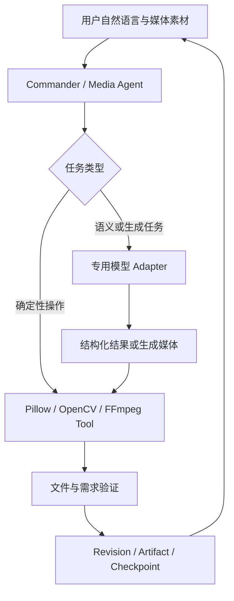

# AgentFlow 多媒体助手开发计划

> 版本：v1.3 | 建立日期：2026-09-16 | 最近更新：2026-09-24
>
> 当前结论：多媒体助手采用“模型负责理解与生成、成熟媒体工具负责精确执行、AgentFlow 负责调度与可靠交付”的路线。AI 调度台现可识别图片编辑意图或 `@图片助手`，将原话带入既有图片工作区；该交接不导入图片、不创建 revision、不调用模型，仍由用户选择当前版本后主动提交。现有图片工作区保留为工程底座并停止横向扩建；MM-2 已完成固定 36 项真实模型输出的开发质量回读。MM-4 已完成语音转写的模型路由、离线协议底座、一次程序生成短音频真实探针，以及受控音视频源/命令白名单底座；尚未形成任务、界面或真实 FFmpeg 闭环。当前不继续建设通用图片编辑器；正式独立复核只在准备对外发布时补充，不阻塞内部开发结论。
>
> 当前门槛：`G0-DEV`（图片模型内部开发准入）、`L1-DEV`（最薄媒体底座开发准入）和 `G2-DEV`（AI 修图开发质量准入）已满足；正式 `G2` 为待独立复核，`G3` 尚未运行。配套评测见[多媒体助手评测与验证方案](MULTIMEDIA_AGENT_EVALUATION.md)。

## 1. 产品定位与纠偏结论

在现有 AgentFlow 内建设一个 `media_agent`，让用户通过自然语言完成 AI 修图、对话式视频剪辑、视频翻译与配音，并得到可以预览、继续修改和下载的真实文件。

本项目不是 Photoshop、Premiere 或剪映的替代品，也不自行训练图片生成、ASR、翻译或 TTS 模型。基础裁剪、转码、混音等能力只作为模型任务的执行工具，不单独包装成主要卖点。

### 1.1 三层职责

| 层级 | 负责什么 | 不负责什么 |
| --- | --- | --- |
| 模型层 | 理解自然语言和素材；生成或修改图像；转写、翻译、配音；生成结构化剪辑决策 | 不直接承担文件版本、权限、恢复、精确编解码和最终交付状态 |
| 媒体工具层 | 使用 Pillow/OpenCV/FFmpeg 等执行精确裁剪、缩放、合成、转码、字幕封装、混音和文件回读 | 不判断用户语义，不自行扩展为完整编辑器 |
| AgentFlow 层 | 模型路由、Tool 调用、任务状态、版本、撤销、预算、权限、失败恢复、Artifact 和交付验证 | 不重写成熟算法、编解码器或第三方模型 |

### 1.2 什么时候直接调用模型

- 需要理解画面、生成内容或进行语义修改时，默认直接调用对应专用模型，例如消除物体、换背景、语音转写、字幕翻译和语音合成。
- 只有多步骤、存在高风险写入或需要用户确认时，才让规划模型先生成结构化计划；不为单一模型调用增加无价值的 Agent 循环。
- 精确尺寸、格式转换、时间轴、局部合成和导出由确定性工具处理，不能只靠提示词保证。
- Provider 如果已经提供成熟的结构化编辑任务，优先通过 Adapter 接入，不在 AgentFlow 内重复实现。

### 1.3 明确不做

- 不继续建设完整图层系统、画笔引擎、自由变换、滤镜商城或 PSD 兼容。
- 不建设完整多轨时间线、特效面板和专业调色界面。
- 不自行实现图像编解码、视频编解码、ASR、机器翻译、TTS 或声音克隆模型。
- 不把模型探针、手工工具数量或 UI 页面数量当作产品进度。
- 不要求所有候选模型全部通过后才开始纵向闭环；只有被当前路线实际依赖的能力才构成前置门槛。

## 2. 功能范围

### 2.1 正式主线

| 编号 | 能力 | 角色 | 首次交付 |
| --- | --- | --- | --- |
| IMG-01 | 素材受控导入、原件保护、版本和导出 | 支撑能力，复用现有实现 | MM-1 |
| IMG-02 | 裁剪、缩放、旋转、格式转换和局部合成 | 确定性 Tool，不作为 AI 卖点 | MM-1 |
| IMG-03 | 根据源图、提示词和可选蒙版执行真实 AI 编辑 | 图片主能力 | MM-2 |
| IMG-04 | 基于真实 revision 进行“上一版”“只改背景”等连续修改 | 图片主能力 | MM-2 |
| IMG-05 | 最小历史、撤销重做和候选结果保留 | 支撑能力；不扩展完整编辑器 | MM-1/MM-2 |
| IMG-06 | 结果回读、来源、费用、失败说明与 Artifact 交付 | 图片主能力 | MM-3 |
| VID-01 | ASR 生成带时间戳转写，必要时由 VLM 补充画面理解 | 视频基础 | MM-4 |
| VID-02 | LLM 根据用户要求生成可校验 EDL，而不是直接“生成视频” | 视频主能力 | MM-5 |
| VID-03 | FFmpeg 按 EDL 精确剪辑、处理字幕并导出 MP4/SRT | 确定性执行 | MM-5 |
| VID-04 | 修改片段或字幕时仅使相关缓存失效 | 视频主能力 | MM-5 |
| LOC-01 | 基于转写分段进行中英翻译、术语和专名约束 | 本地化主能力 | MM-6 |
| LOC-02 | TTS 分段配音、试听和局部重配 | 本地化主能力 | MM-6 |
| LOC-03 | FFmpeg 执行时长适配、混音和字幕/配音视频封装 | 确定性执行 | MM-6 |
| LOC-04 | ASR、翻译、TTS 独立配置并记录实际能力和用量 | 模型治理 | MM-6 |

首期只交付 IMG-01 至 IMG-06。IMG-01/02/05 已经形成的工程能力作为底座冻结维护；MM-2 不以新增本地编辑按钮为目标。

### 2.2 可选增强

自动抠图、任意对象分割、视频目标追踪、声音分离、声音克隆、文生视频和实时多模态会话都属于独立增强。只有主线通过对应发布门槛，并且增强能力有明确用户任务、模型许可、资源预算和评测集时，才单独立项。

Lite Matting 和 SAM 2.1 Tiny 当前只是可选工具候选。手工蒙版或图片编辑模型本身已能支持首个 AI 修图闭环时，它们不阻塞 MM-2。

## 3. 目标架构



典型路径：

```text
AI 修图：图片 + 提示词 + 可选蒙版 -> 图片编辑模型 -> 局部合成/格式处理 -> 新 revision
视频剪辑：视频 -> ASR/VLM -> LLM 生成 EDL -> FFmpeg 渲染 -> MP4/SRT
翻译配音：视频 -> ASR -> 翻译模型 -> TTS -> 对齐/混音/封装 -> 配音视频
```

模型输出必须先转为 Pydantic 契约或受控媒体文件，不能让自由文本直接拼接 Shell/FFmpeg 参数。

## 4. 模型与工具选型

| 路由 | 当前用途 | 开发前最低要求 | 是否阻塞当前阶段 |
| --- | --- | --- | --- |
| `media_planning` | 多步骤意图转结构化 Tool/参数 | 结构化输出和固定意图集可用 | 阻塞 MM-2；当前已满足 |
| `media_image_edit` | 源图编辑、局部消除、换背景和改字 | 支持真实图片输入；固定样本可回读；失败语义明确 | 阻塞 MM-2；当前候选为 `qwen-image-3.0-pro`，已满足内部开发准入 |
| `media_vision` | 画面理解或结果辅助检查 | 只有任务确实需要看图时才接入 | 不阻塞首个修图闭环 |
| `media_segmentation` | 自动生成对象蒙版 | 对象选择质量和资源可接受 | 可选，SAM 不阻塞 MM-2 |
| `media_matting` | 发丝、半透明边缘 alpha | 抠图质量和资源可接受 | 可选，Lite Matting 不阻塞 MM-2 |
| `media_transcription` | 带时间戳转写 | 当前固定 `qwen_audio / qwen-audio-3.1-asr-flash`，短音频可取得稳定句/词时间戳；长媒体仍待受控存储与异步链路 | 阻塞 MM-4 |
| `media_translation` | 字幕翻译 | 结构化字幕段、术语和专名可约束 | 阻塞 MM-6 |
| `media_speech` | 分段 TTS | 声音、语言、时长和使用条款明确 | 阻塞 MM-6 |

模型名称和 Provider 只存在于 ModelGateway/Profile/Adapter，不能写死在 Agent、Workflow 或 UI 业务逻辑中。用户可在模型管理中选择兼容模型，系统依据真实能力过滤参数，不因模型名称推测它支持图片编辑、音频或视频。

### 4.1 当前 Qwen 3.0 尺寸边界

`media_image_edit` 的当前默认路线是 `qwen-image-3.0-pro`。依据 [Qwen Image 3.0 官方 API 参考](https://help.aliyun.com/zh/model-studio/qwen-image-generation-and-editing-api-reference)，图生图输入建议宽高各为 `384-2048` 像素、文件不超过 `10 MB`；指定输出尺寸时，总像素需在 `512 x 512` 到 `2048 x 2048` 之间。工作区为保证 revision 可审计，会请求并回读与当前版本完全相同的输出，不接受 Provider 返回后静默拉伸。因此在调用前按上述交集检查当前版本，避免付费请求后才得到参数错误。

“调整尺寸”是 Pillow 在本地创建的新 revision，不调用 AI 模型；预览画布仅随工作区大小自适应显示，不会改变文件像素。该操作必须提交 `resize_width` 和 `resize_height`，裁剪同样必须提交 `crop_*` 字段，客户端不得以 UI 内部的通用 `width/height` 字段直接越过 API 契约。

### 4.2 MM-4 首期语音转写边界

`media_transcription` 已新增独立的 `qwen_audio / qwen-audio-3.1-asr-flash` Profile 和 Adapter；它复用用户已保存的 Qwen Provider 密钥，但 Base URL、模型选择和路由审计彼此独立。首期选用该模型，是因为官方 HTTP 接口可直接返回稳定的句级、词级时间戳；`qwen3-asr-flash` 的 OpenAI-Compatible 路径不返回时间戳，不能作为剪辑时间线的基础。模型能力与接口边界以 [Qwen ASR 模型说明](https://help.aliyun.com/zh/model-studio/asr-model) 和 [Qwen Audio 3.x ASR HTTP API](https://help.aliyun.com/en/model-studio/fun-asr-flash-recorded-speech-recognition-http-api) 为准。

- 当前 Adapter 只接收内存中的 WAV/MP3 字节，原始输入上限 `7 MiB`，编码为 Base64 后直接请求 Provider；不传本机路径，不上传到公共 OSS，也不把 Base64 写入任务、聊天、长期记忆或日志。
- 不足一分钟时解析 Provider 返回的 JSON 终态，较长音频解析 SSE；两条路径都只接受已稳定的句级结果及其词级时间戳。显式拒绝、限流等结果可明确呈现，网络/5xx 导致结果未知时不自动重试付费请求。
- `media_source_preparation` 已接收受控内存字节并写入私有源文件目录，记录范围、哈希与有限容器/流元数据；`ffprobe` 和 `ffmpeg` 只能由 `source_id` 解析内部文件，并固定提取首条音轨为 `16 kHz` 单声道 PCM WAV。素材原件不会覆盖，派生 WAV 需回读、哈希一致且不超过 `7 MiB` 才能交给 ASR。
- 当前机器尚未检测到 `ffprobe`/`ffmpeg`，因此真实媒体探测和音轨提取尚未执行；`/health` 会提前报告该依赖缺失。长媒体分片、Filetrans/OSS、任务/checkpoint、字幕交付和 Qt 工作区仍未实现，不能因为模型路由或离线命令夹具已存在就对用户宣称“已支持视频转写”。

确定性工具优先采用成熟依赖：

- 图片：Pillow 为首期执行与回读工具；OpenCV 仅在确有算法需求时引入。
- 视频和音频：FFmpeg/ffprobe 负责解码、裁剪、转码、字幕、混音和媒体探测。
- AgentFlow 只维护类型化参数、进程隔离、资源限制、产物验证和恢复边界。

## 5. 最小工程契约

| 契约 | 必需内容 | 边界 |
| --- | --- | --- |
| `MediaAsset v1` | asset_id、project_scope、hash、MIME、metadata | 服务端解析路径；模型只得到受控字节或临时引用 |
| `MediaProject v1` | project_id、mode、revision、source_asset_ids、current_result | 与聊天会话分离，可重启打开 |
| `ImageRevision v1` | revision、parent_revision、result_asset、operation_ref | 每次模型或工具执行产生新版本，不覆盖原图 |
| `MediaEditRequest v1` | goal、base_revision、optional_mask、route/profile、budget | 单步编辑可直接执行；多步才生成 plan |
| `MediaOperation v1` | tool/model version、input hashes、params、attempt、usage | 不保存无界 base64 到消息、checkpoint 或长期记忆 |
| `EditDecisionList v1` | source in/out、output order、time_base、track refs | 视频阶段新增；使用源 PTS，不用标称帧率猜时间 |
| `MediaVerification v1` | 文件检查、需求检查、warnings、evidence refs | 未检查不能标通过 |

现有 SQLite、WorkflowRun、Task、Artifact、WebSocket、ModelGateway 和权限系统继续作为唯一控制面，不为媒体 Agent 新建平行任务系统。

### 5.1 可靠性边界

- 原始素材不覆盖；输出先写临时文件，回读后原子提交并登记 Artifact。
- 云端超时或连接中断导致结果未知时不自动重发付费请求。
- 取消后停止新动作；Provider 不支持远端取消时明确说明仍可能计费。
- 请求、模型 Profile、参数、usage、输入输出哈希和失败原文可追踪，但不记录 API Key。
- 二进制媒体放受控文件区，SQLite 保存引用；不把视频或 base64 正文写入聊天和长期记忆。
- 每个阶段只建设下一个纵向闭环必需的字段和 UI，不提前抽象通用媒体平台。

## 6. 用户流程与 UI 边界

主入口仍是 AI 调度台：用户可直接描述“去掉杂物、换背景”等目标，或点名 `@图片助手`。Commander 只创建一个无文件、无网络权限的工作区交接节点，并把清理后的指令预填到现有图片工作区；它不会隐式导入图片、创建项目或调用 Provider。用户在工作区选择当前图片 revision 并主动点击“开始修图”后，才进入模型调用、版本回读、预览、继续修改、撤销和下载链路。

专业工作区只承担轻量核对：

- 图片：原图/结果对比、可选矩形或笔刷蒙版、版本和导出。
- 视频：播放器、转写文本、片段列表和边界数值；首版不建设专业多轨时间线。
- 翻译配音：原文/译文分段、声音试听和局部重配；首版不做声音训练界面。

现有“视觉工作室 -> 图片工作区”已经支持本地导入、不可覆盖修订、确定性编辑、矩形蒙版、栅格图层、撤销重做和 PNG 导出。该界面作为已有底座保留，但从本版计划起冻结功能范围：只修阻断 AI 闭环的缺陷，不继续增加自由变换、文本图层、复杂图层或更多滤镜。

完整 Windows DPI、长文本、错误态和可访问性检查放在 G3 发布准入，不再阻塞模型接入阶段。日常 UI 开发按照“静态审查 -> 组件/API 测试 -> 单条 GUI 冒烟 -> 发布前集中人工验收”执行。

## 7. 阶段计划与门槛

| 阶段 | 目标 | 出口 | 当前状态 |
| --- | --- | --- | --- |
| MM-0 模型可行性 | 确认规划与图片编辑模型能在固定素材上真实调用，记录输出、失败语义和用量字段 | `G0-DEV`：允许进入内部纵向开发，不代表用户可用 | 已满足。Qwen 3.0 Pro 和规划模型已有真实证据；独立质量复核移至 G2 |
| MM-1 最薄媒体底座 | 受控导入、原图保护、新 revision、撤销、回读导出、Runtime/Artifact | `L1-DEV`：足以承载模型结果 | 已满足并冻结。已有额外蒙版/图层能力不再继续扩建 |
| MM-2 AI 修图纵向闭环 | 调度台安全交接指令，工作区由用户选择当前 revision 后提交图片与提示词，调用 `media_image_edit`，写入新 revision，预览、继续修改、撤销和导出 | `G2-DEV`：固定真实样本的最低效果通过；正式 `G2` 再补独立主观复核 | `media_agent` 已具备 manifest、动作准入和 Node Contract；调度台可识别图片编辑并预填工作区指令，不会隐式调用模型。Qt 图片工作区已接入状态和异步结果轮询；后端受控字节输入、失败分类、版本提交、取消与重启对账均有离线验证。36 项真实结果已全部通过开发质量回读；正式独立复核和完整客户端发布流程仍待后续按需执行 |
| MM-3 图片发布准入 | 权限、费用、取消恢复、Qt 完整流程、DPI、原功能回归和用户可理解错误 | `G3`：AI 修图可正式对用户开放 | 未开始 |
| MM-4 视频技术闭环 | ASR 时间戳、LLM 生成 EDL、FFmpeg 渲染一个真实视频 | `G4`：转写、EDL、同步和导出可验证 | 已开始模型/协议底座：`media_transcription` 路由、受控媒体源与音轨提取命令契约均有离线回归，并完成一次程序生成 WAV 的真实转写探针；当前缺少本机 FFmpeg，尚无任务或 UI，G4 未运行 |
| MM-5 对话式剪辑 | 连续修改片段/字幕、增量失效和可靠交付 | `G5`：语义选段、边界、同步和恢复通过 | 未开始 |
| MM-6 翻译与配音 | ASR -> 翻译 -> TTS -> 对齐/混音/封装 | `G6`：字幕和配音分别通过质量、成本与失败验收 | 未开始 |
| MM-7 整合发行 | 跨 Agent 素材协作、升级与整体回归 | `G7`：已准入能力联合发布 | 未开始 |

### 7.1 内部开发门槛和发布门槛

- `G0-DEV`/`L1-DEV`/`G2-DEV` 只回答“是否有足够证据开始或继续实现纵向闭环”，不要求把所有候选模型和所有 UI 档位验收到发布水平。
- 正式 `G2`/`G3` 才回答“AI 修图质量是否达标、用户是否能够稳定使用”。独立人工复核、费用核对和 Windows DPI 属于这些门槛；空白评审表必须显示为待评审，而不是未通过。
- 历史请求缺少无法追补的逐次金额时如实记录 unknown，不重新消耗额度补历史数据；从新闭环开始记录 request ID 和 Provider usage。
- 可选的 Matting/Segmentation 只在产品路径实际启用时进入 required；未启用时不阻塞主线。

## 8. 下一轮执行清单

MM-2 已完成下列工程项；后续只在准备发布时执行正式独立复核与 G3，不再为图片工作区横向增加编辑功能：

1. 已冻结图片工作区范围，不再新增本地编辑器功能。
2. 已核对并复用 Qwen Image Adapter、ModelGateway、Runtime 和媒体 revision 调用链。
3. 已定义 `MediaImageAiEditRequest/Result`，模型结果只能经下载、解码、尺寸检查、PNG 回读和 SQLite revision 提交进入工程。
4. 已用离线替身跑通成功、明确拒绝、限流、超时未知、下载失败、版本冲突、取消和重启对账，不调用真实模型。
5. 已在现有图片工作区接入最小 AI 修图页：当前 revision 与一句自然语言指令提交到固定模型路由，客户端轮询真实状态并复用版本预览、撤销和导出；不新增平行编辑器。
6. 已通过 `backend/scripts/verify_live_media_ai_edit.py --live` 发起一次程序生成的 `1024 x 768` 图片请求。`qwen_image / qwen-image-3.0-pro` 在约 `49.243 s` 后返回 1 张同尺寸 PNG；结果已回读并登记为 `ai_image_edit` revision，Provider usage 为输入/输出各 1 张，逐请求金额为 `unknown`。脱敏 manifest 位于忽略目录 `data/media_evaluations/live_media_ai_edit_20260923T025239Z/`。
7. 已落地 G2 质量集离线数据契约：`verify_media_g2_quality_suite.py` 会拒绝非 `12` 来源、开发/留出集非 `8/4`、非 `36` 任务、跨 split 复用来源、类别配额失衡或评审协议缺失的 suite。2026-09-23 已用 12 个公开来源冻结真实 suite，并通过 `probe_qwen_image_g2_quality.py` 对 `qwen_image / qwen-image-3.0-pro` 执行 36 项各一次的真实调用；全部回读为同尺寸 PNG，未发生自动重试。2026-09-24 的 `evaluate_media_g2_development_quality.py` 仅回读这些既有输出，以本地 OCR 和类别效果规则得到换背景 `12/12`、移物 `12/12`、改字 `12/12`，开发集 `24/24`、留出集 `12/12`，因此 `G2-DEV` 已满足。`verify_media_g2_review_packet.py` 的两份空白表只表示正式独立复核待进行，不再阻塞当前开发或被误报为失败。
8. 已注册 `media_agent` 并补齐 `open_media_workspace` 的动作准入和 Node Contract。调度台识别图片编辑词或 `@图片助手` 后，只传递本轮文字到图片工作区；`verify_media_dispatch_handoff.py` 固定验证无材料范围、无权限、无 Provider 调用和 PPT 路由优先级，Windows GUI 冒烟验证指令预填且未选择 revision 时“开始修图”保持禁用。

MM-4 当前只完成下列起步项，不能提前计为视频功能：

1. 已新增 `media_transcription` 路由、`qwen_audio` Profile 和 `qwen-audio-3.1-asr-flash` Adapter；路由可独立配置模型，安全复用已保存的 Qwen 密钥。
2. 已用 HTTP MockTransport 验证 Base64 请求、短音频 JSON 与 SSE 稳定时间戳归一化、usage/request ID、明确 Provider 拒绝、未知结果不自动重试和本地输入上限。
3. 已执行 `probe_qwen_audio_transcription.py --live` 的一次真实调用：Windows SAPI 生成的 `3.314 s` 英文 WAV 经 `qwen_audio / qwen-audio-3.1-asr-flash` 在约 `2.348 s` 返回正确文本、1 个稳定句段和 5 个词级时间戳；Provider usage 为输入 `138`、输出 `6`、总计 `144` tokens，逐请求金额为 `unknown`。夹具与脱敏 manifest 位于忽略目录 `data/media_evaluations/qwen_audio_transcription_20260924T031159Z/`。
4. 已新增私有 `media_source_preparation`：上层只能传内存字节，`source_id` 绑定项目范围和源哈希；`ffprobe` 的容器/流解析、`ffmpeg` 首音轨 `16 kHz` 单声道 WAV 命令白名单、派生文件回读/哈希/上限/复用均由临时夹具覆盖。`/health` 仍会报告未显式配置的 FFmpeg 依赖，不能把开发机安装误判为用户运行时已就绪。
5. 已用 `probe_media_source_preparation.py --execute` 对程序生成的 `2 s` 黑色视频与 `880 Hz` 音调执行一次真实 `ffprobe -> ffmpeg -> WAV 回读`。受控源探测为 MP4/MPEG-4 + AAC（第 1 条音轨，`48 kHz` 单声道），派生 WAV 回读为 `16 kHz` 单声道 PCM、`32,000` frames、`64,078` bytes，源与派生哈希均一致。开发机验证使用 `Gyan.FFmpeg.Essentials 9.0.1` 的显式路径，证据位于忽略目录 `data/media_evaluations/media_source_preparation_e1_20260924T065700Z/`；它不修改应用配置，也不包含用户媒体或模型请求。
6. 下一步才是把已验证的受控 WAV 接入一次性、可恢复的转写任务。当前短音频探针和 E1 不等于视频、字幕、EDL 或 G4。

本阶段完成标准不是“新增了多少按钮”，而是用户输入一张图和一句自然语言后，能得到一张经过真实模型处理、可追踪、可撤销、可继续修改且可下载的图片。

## 9. 参考项目与使用原则

| 参考 | 只吸收什么 | 不做什么 |
| --- | --- | --- |
| [ai-picture-editor](https://github.com/yuyuanweb/ai-picture-editor) | 规划、校验、选区和编辑命令分工 | 不复制完整前端或教学框架 |
| [video-use](https://github.com/browser-use/video-use) / [FunClip](https://github.com/modelscope/FunClip) | 转写、EDL 和文本驱动剪辑思路 | 不直接嵌入其完整运行时 |
| [VideoLingo](https://github.com/Huanshere/VideoLingo) | 转写、翻译、字幕、配音的阶段拆分 | 不重复引入一套数据库和 UI |
| [Qwen3-TTS](https://github.com/QwenLM/Qwen3-TTS) | 可选 TTS Provider/本地模型路线 | 不自行训练声音，不默认开放克隆 |
| [Grounded-SAM-2](https://github.com/IDEA-Research/Grounded-SAM-2) | 可选语义分割与视频追踪思路 | 不作为首期 AI 修图前置 |

外部项目只提供设计证据和候选工具。AgentFlow 始终保留任务、权限、模型配置、审计、Artifact、Verifier 和多 Provider 的所有权。
