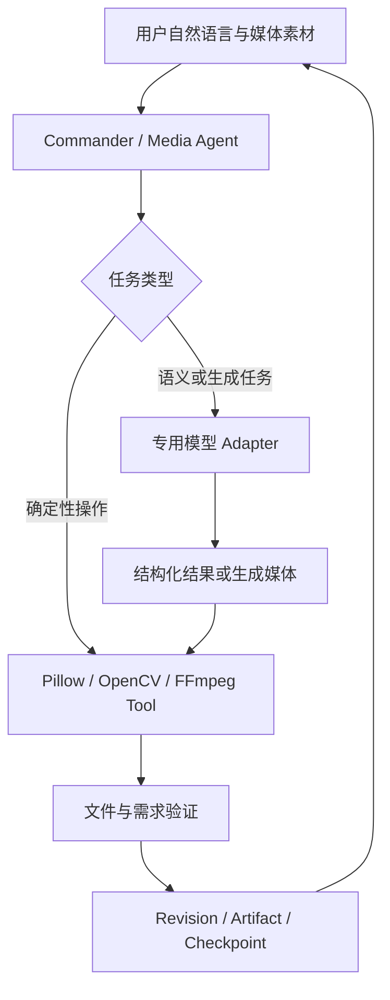

# AgentFlow 多媒体助手开发计划

> 版本：v1.18 | 建立日期：2026-09-16 | 最近更新：2026-10-08
>
> 当前结论：视觉工坊和音视频工坊继续作为 `media_agent` 的两条核心产品线迭代。冻结的是通用图片编辑器、多轨时间线、自研编解码器及自研 ASR/TTS/分割模型，不是用户能力。现有图片工作区已跑通自然语言移物、换背景、改字与版本交付，不再把点选对象另包装成近期功能；只有真实任务证明模型容易误改非目标区域时，才补语义选区。音视频工坊已跑通“导入 -> 分段 ASR -> 模型选段 -> 用户确认 -> MP4 回读”的中文口播闭环，并完成 `MM-5A-DEV` 的候选续改和完整/成片 SRT 交付。`MM-5B-HTML-DEV` 已完成受限讲解计划、关键帧、单文件离线 HTML、Qt、调度台和真实模型交付；可编辑 PPTX 的结构化交接独立为下一小项，尚未实现。后端、调度台、Qt 编译和 Windows GUI 自动化均已回归通过；此前阻塞 GUI 的根因是脚本按被 QSS 覆盖的内部对象名查找控件，不是稳定的启动崩溃。
>
> 当前门槛：`G0-DEV`（图片模型内部开发准入）、`L1-DEV`（最薄媒体底座开发准入）、`G2-DEV`（AI 修图开发质量准入）、`MM-4-DEV`（中文口播视频内部闭环）、`MM-5A-DEV`（二次剪辑与字幕）和 `MM-5B-HTML-DEV`（离线动态讲解）已满足；正式 `G2` 为待独立复核，`G3`、`G4`、`G5` 尚未运行。配套评测见[多媒体助手评测与验证方案](MULTIMEDIA_AGENT_EVALUATION.md)。

## 1. 产品定位与纠偏结论

在现有 AgentFlow 内建设一个 `media_agent`，让用户通过自然语言完成 AI 修图、对话式视频剪辑、视频翻译与配音，并得到可以预览、继续修改和下载的真实文件。

本项目不是 Photoshop、Premiere 或剪映的替代品，也不自行训练图片生成、ASR、翻译或 TTS 模型。基础裁剪、转码、混音等能力只作为模型任务的执行工具，不单独包装成主要卖点。

### 1.1 三层职责

| 层级 | 负责什么 | 不负责什么 |
| --- | --- | --- |
| 模型层 | 理解自然语言和素材；生成或修改图像；转写、翻译、配音；生成结构化剪辑决策 | 不直接承担文件版本、权限、恢复、精确编解码和最终交付状态 |
| 媒体工具层 | 使用 Pillow/OpenCV/FFmpeg 等执行精确裁剪、缩放、合成、转码、字幕封装、混音和文件回读 | 不判断用户语义，不自行扩展为完整编辑器 |
| AgentFlow 层 | 模型路由、Tool 调用、任务状态、版本、撤销、预算、权限、失败恢复、Artifact 和交付验证 | 不重写成熟算法、编解码器或第三方模型 |

### 1.2 什么时候直接调用模型

- 需要理解画面、生成内容或进行语义修改时，默认直接调用对应专用模型，例如消除物体、换背景、语音转写、字幕翻译和语音合成。
- 只有多步骤、存在高风险写入或需要用户确认时，才让规划模型先生成结构化计划；不为单一模型调用增加无价值的 Agent 循环。
- 精确尺寸、格式转换、时间轴、局部合成和导出由确定性工具处理，不能只靠提示词保证。
- Provider 如果已经提供成熟的结构化编辑任务，优先通过 Adapter 接入，不在 AgentFlow 内重复实现。

### 1.3 明确不做

- 不继续建设完整图层系统、画笔引擎、自由变换、滤镜商城或 PSD 兼容。
- 不建设完整多轨时间线、特效面板和专业调色界面。
- 不自行实现图像编解码、视频编解码、ASR、机器翻译、TTS 或声音克隆模型。
- 不把模型探针、手工工具数量或 UI 页面数量当作产品进度。
- 不要求所有候选模型全部通过后才开始纵向闭环；只有被当前路线实际依赖的能力才构成前置门槛。

## 2. 功能范围

### 2.1 正式主线

| 编号 | 能力 | 角色 | 首次交付 |
| --- | --- | --- | --- |
| IMG-01 | 素材受控导入、原件保护、版本和导出 | 支撑能力，复用现有实现 | MM-1 |
| IMG-02 | 裁剪、缩放、旋转、格式转换和局部合成 | 确定性 Tool，不作为 AI 卖点 | MM-1 |
| IMG-03 | 根据源图和提示词执行真实 AI 编辑；Provider 明确支持时才附加选区蒙版 | 图片主能力 | MM-2 |
| IMG-04 | 基于真实 revision 进行“上一版”“只改背景”等连续修改 | 图片主能力 | MM-2 |
| IMG-05 | 最小历史、撤销重做和候选结果保留 | 支撑能力；不扩展完整编辑器 | MM-1/MM-2 |
| IMG-06 | 结果回读、来源、费用、失败说明与 Artifact 交付 | 图片主能力 | MM-3 |
| VID-01 | ASR 生成带时间戳转写；纯画面语义不足时再评估 VLM | 视频基础；VLM 非当前前置 | MM-4 |
| VID-02 | LLM 根据用户要求生成可校验 EDL，而不是直接“生成视频” | MM-4 先交付一次待确认候选；连续修改留给 MM-5 | MM-4-DEV/MM-5 |
| VID-03 | FFmpeg 按 EDL 剪辑并导出 MP4；字幕/SRT 另行验收 | 当前只复用单源顺序片段 MP4 内核 | MM-4-DEV/MM-5 |
| VID-04 | 修改片段或字幕时仅使相关缓存失效 | 视频主能力 | MM-5 |
| VID-05 | 从转写、时间来源与关键画面生成结构化讲解，可交付动态 HTML 或委派 PPT 助手生成可编辑 PPTX | 视频内容再创作；不是只返回一段摘要 | MM-5B |
| LOC-01 | 基于转写分段进行中英翻译、术语和专名约束 | 本地化主能力 | MM-6 |
| LOC-02 | TTS 分段配音、试听和局部重配 | 本地化主能力 | MM-6 |
| LOC-03 | FFmpeg 执行时长适配、混音和字幕/配音视频封装 | 确定性执行 | MM-6 |
| LOC-04 | ASR、翻译、TTS 独立配置并记录实际能力和用量 | 模型治理 | MM-6 |

图片首期 IMG-01 至 IMG-06 已形成可复用底座；底层编辑器范围冻结，视觉工坊继续通过自然语言 AI 修图和真实失败驱动的质量改进迭代，不为增加功能数量另造入口。视频的 VID-01/02/03 单源最小子集及 MM-5A 的连续修改/SRT 子集已经跑通，下一项仅建设 MM-5B 动态讲解交付。每次只建设一个可交付纵向任务，不并行铺开完整编辑器。

### 2.2 可选增强

自动抠图、视频目标追踪、声音分离、声音克隆、文生视频和实时多模态会话仍属于独立增强。只有主线通过对应内部开发门槛，并且增强能力有明确用户任务、模型许可、资源预算和评测集时，才单独立项。

SAM 2.1 Tiny 已有本地探针，但当前 `qwen-image-3.0-pro` 已能凭自然语言完成移物、换背景和改字，且现用 OpenAI-Compatible 图像接口不接收 `mask`。因此点选/语义蒙版不单独立项；只有固定样本证明模型频繁误改非目标区域时，才把现有 SAM2 或 Grounded-SAM-2 作为精度补丁。Lite Matting/`rembg` 与现有 BiRefNet 路线功能重合，暂不重复接入。

## 3. 目标架构


```mermaid
flowchart TD
    U[用户自然语言与媒体素材] --> R[Commander / Media Agent]
    R --> D{任务类型}
    D -->|语义或生成任务| M[专用模型 Adapter]
    D -->|确定性操作| T[Pillow / OpenCV / FFmpeg Tool]
    M --> P[结构化结果或生成媒体]
    P --> T
    T --> V[文件与需求验证]
    V --> S[Revision / Artifact / Checkpoint]
    S --> U
```

典型路径：

```text
AI 修图：图片 + 提示词 -> 图片编辑模型 -> 格式处理 -> 新 revision
精确选区（条件能力）：图片 + 已确认蒙版 -> 支持 mask 的图片编辑 Provider -> 新 revision
视频剪辑：视频 -> ASR/VLM -> LLM 生成 EDL -> FFmpeg 渲染 -> MP4/SRT
翻译配音：视频 -> ASR -> 翻译模型 -> TTS -> 对齐/混音/封装 -> 配音视频
```

模型输出必须先转为 Pydantic 契约或受控媒体文件，不能让自由文本直接拼接 Shell/FFmpeg 参数。

## 4. 模型与工具选型

| 路由 | 当前用途 | 开发前最低要求 | 是否阻塞当前阶段 |
| --- | --- | --- | --- |
| `media_planning` | 多步骤意图转结构化 Tool/参数 | 结构化输出和固定意图集可用 | 阻塞 MM-2；当前已满足 |
| `media_image_edit` | 源图编辑、局部消除、换背景和改字 | 支持真实图片输入；固定样本可回读；失败语义明确 | 阻塞 MM-2；当前候选为 `qwen-image-3.0-pro`，已满足内部开发准入 |
| `media_vision` | 画面理解或结果辅助检查 | 只有任务确实需要看图时才接入 | 不阻塞首个修图闭环 |
| `media_segmentation` | 自动生成对象蒙版 | 对象选择质量和资源可接受 | 可选，SAM 不阻塞 MM-2 |
| `media_matting` | 发丝、半透明边缘 alpha | 抠图质量和资源可接受 | 可选，Lite Matting 不阻塞 MM-2 |
| `media_transcription` | 带时间戳转写 | 当前固定 `qwen_audio / qwen-audio-3.1-asr-flash`，短音频可取得稳定句/词时间戳；长媒体仍待受控存储与异步链路 | 阻塞 MM-4 |
| `media_translation` | 字幕翻译 | 结构化字幕段、术语和专名可约束 | 阻塞 MM-6 |
| `media_speech` | 分段 TTS | 声音、语言、时长和使用条款明确 | 阻塞 MM-6 |

模型名称和 Provider 只存在于 ModelGateway/Profile/Adapter，不能写死在 Agent、Workflow 或 UI 业务逻辑中。用户可在模型管理中选择兼容模型，系统依据真实能力过滤参数，不因模型名称推测它支持图片编辑、音频或视频。

### 4.1 当前 Qwen 3.0 尺寸边界

`media_image_edit` 的当前默认路线是 `qwen-image-3.0-pro`。依据 [Qwen Image 3.0 官方 API 参考](https://help.aliyun.com/zh/model-studio/qwen-image-generation-and-editing-api-reference)，图生图输入建议宽高各为 `384-2048` 像素、文件不超过 `10 MB`；指定输出尺寸时，总像素需在 `512 x 512` 到 `2048 x 2048` 之间。工作区为保证 revision 可审计，会请求并回读与当前版本完全相同的输出，不接受 Provider 返回后静默拉伸。因此在调用前按上述交集检查当前版本，避免付费请求后才得到参数错误。

“调整尺寸”是 Pillow 在本地创建的新 revision，不调用 AI 模型；预览画布仅随工作区大小自适应显示，不会改变文件像素。该操作必须提交 `resize_width` 和 `resize_height`，裁剪同样必须提交 `crop_*` 字段，客户端不得以 UI 内部的通用 `width/height` 字段直接越过 API 契约。

### 4.2 MM-4 首期语音转写边界

`media_transcription` 已新增独立的 `qwen_audio / qwen-audio-3.1-asr-flash` Profile 和 Adapter；它复用用户已保存的 Qwen Provider 密钥，但 Base URL、模型选择和路由审计彼此独立。首期选用该模型，是因为官方 HTTP 接口可直接返回稳定的句级、词级时间戳；`qwen3-asr-flash` 的 OpenAI-Compatible 路径不返回时间戳，不能作为剪辑时间线的基础。模型能力与接口边界以 [Qwen ASR 模型说明](https://help.aliyun.com/zh/model-studio/asr-model) 和 [Qwen Audio 3.x ASR HTTP API](https://help.aliyun.com/en/model-studio/fun-asr-flash-recorded-speech-recognition-http-api) 为准。

- 当前 Adapter 只接收内存中的 WAV/MP3 字节，原始输入上限 `7 MiB`，编码为 Base64 后直接请求 Provider；不传本机路径，不上传到公共 OSS，也不把 Base64 写入任务、聊天、长期记忆或日志。
- 不足一分钟时解析 Provider 返回的 JSON 终态，较长音频解析 SSE；两条路径都只接受已稳定的句级结果及其词级时间戳。显式拒绝、限流等结果可明确呈现，网络/5xx 导致结果未知时不自动重试付费请求。
- `media_source_preparation` 已接收受控内存字节并写入私有源文件目录，记录范围、哈希与有限容器/流元数据；`ffprobe` 和 `ffmpeg` 只能由 `source_id` 解析内部文件，并固定提取首条音轨为 `16 kHz` 单声道 PCM WAV。素材原件不会覆盖；单段不超过 `7 MiB` 时直接提交，超过时在私有目录按固定 `210 s` 边界切为最多 `8` 段，每段回读、哈希验证后才交给 ASR。
- 开发机已用本机 `FFmpeg 9.0.1` 完成真实探测、音轨提取及 EDL 渲染回读。运行时仍依赖 `AGENTFLOW_FFMPEG_PATH` / `AGENTFLOW_FFPROBE_PATH` 或 PATH 中的同名程序；缺失时任务会明确失败，不会伪造交付。Qt 工作区现可本地预览、受控导入、显式提交 ASR、展示带时间标记结果，并基于当前目标生成和复核候选。多段转写会先说明模型调用次数，按顺序提交并映射回原视频时间轴；2026-09-30 已用真实公开中文技术演讲完成用户确认后的 MP4 渲染与回读。`MM-5A` 已增加同项目/同视频/同转写绑定的候选父版本、完整 SRT 与成片 SRT；SRT 从已验证转写和受限 EDL 确定性映射、UTF-8 回读后登记 Artifact，不会调用 ASR、规划模型或 FFmpeg。完整发布质量仍需 `G4/G5`。

确定性工具优先采用成熟依赖：

- 图片：Pillow 为首期执行与回读工具；OpenCV 仅在确有算法需求时引入。
- 视频和音频：FFmpeg/ffprobe 负责解码、裁剪、转码、字幕、混音和媒体探测。
- AgentFlow 只维护类型化参数、进程隔离、资源限制、产物验证和恢复边界。

### 4.3 MM-6 AI 配音模型边界

视频配音优先走用户已配置的 Qwen 云端能力，不要求客户端本机部署大模型。模型能力以[阿里云百炼语音合成概述](https://help.aliyun.com/zh/model-studio/tts-model)为准；`media_speech` 保持独立路由，并按 Provider 实际能力提供三种音色来源：

| 模式 | 用户体验 | 首选候选 | 安全边界 |
| --- | --- | --- | --- |
| 系统音色 | 从可试听音色库选择，再用自然语言控制语速、情绪和风格 | `qwen-audio-3.1-tts-flash` 或 `qwen3-tts-instruct-flash` | 默认开放；保存模型、voice ID、指令和实际用量 |
| 声音设计 | 输入“沉稳青年男声、纪录片语气”等描述，先试听再用于整段视频 | `qwen3-tts-vd-2026-01-26` 或 Qwen-Audio/CosyVoice voice design | 生成新音色并登记来源，不冒充真人 |
| 声音复刻 | 上传有权使用的参考录音，创建可复用的相似音色 | `qwen3-tts-vc-2026-01-22` 或 Qwen-Audio/CosyVoice voice enrollment | 默认关闭；必须显式确认授权、用途和保留期限，支持删除，不提供名人仿声模板 |

首期视频配音使用非实时 HTTP 合成，先保证分段试听、局部重配、时长适配和真实文件交付；实时 WebSocket 与本地 Qwen3-TTS 仅作为后续低延迟/离线选项，不阻塞主线。

## 5. 最小工程契约

| 契约 | 必需内容 | 边界 |
| --- | --- | --- |
| `MediaAsset v1` | asset_id、project_scope、hash、MIME、metadata | 服务端解析路径；模型只得到受控字节或临时引用 |
| `MediaProject v1` | project_id、mode、revision、source_asset_ids、current_result | 与聊天会话分离，可重启打开 |
| `ImageRevision v1` | revision、parent_revision、result_asset、operation_ref | 每次模型或工具执行产生新版本，不覆盖原图 |
| `MediaEditRequest v1` | goal、base_revision、optional_mask、route/profile、budget | 单步编辑可直接执行；多步才生成 plan |
| `MediaOperation v1` | tool/model version、input hashes、params、attempt、usage | 不保存无界 base64 到消息、checkpoint 或长期记忆 |
| `EditDecisionList v1` | source in/out、output order、time_base、track refs | 视频阶段新增；使用源 PTS，不用标称帧率猜时间 |
| `MediaVerification v1` | 文件检查、需求检查、warnings、evidence refs | 未检查不能标通过 |

现有 SQLite、WorkflowRun、Task、Artifact、WebSocket、ModelGateway 和权限系统继续作为唯一控制面，不为媒体 Agent 新建平行任务系统。

### 5.1 可靠性边界

- 原始素材不覆盖；输出先写临时文件，回读后原子提交并登记 Artifact。
- 云端超时或连接中断导致结果未知时不自动重发付费请求。
- 取消后停止新动作；Provider 不支持远端取消时明确说明仍可能计费。
- 请求、模型 Profile、参数、usage、输入输出哈希和失败原文可追踪，但不记录 API Key。
- 二进制媒体放受控文件区，SQLite 保存引用；不把视频或 base64 正文写入聊天和长期记忆。
- 每个阶段只建设下一个纵向闭环必需的字段和 UI，不提前抽象通用媒体平台。

## 6. 用户流程与 UI 边界

主入口仍是 AI 调度台：用户可直接描述“去掉杂物、换背景”等目标，或点名 `@图片助手`。Commander 只创建一个无文件、无网络权限的工作区交接节点，并把清理后的指令预填到现有图片工作区；它不会隐式导入图片、创建项目或调用 Provider。用户在工作区选择当前图片 revision 并主动点击“开始修图”后，才进入模型调用、版本回读、预览、继续修改、撤销和下载链路。

专业工作区只承担轻量核对：

- 图片：原图/结果对比、自然语言 AI 修图、版本和导出。现有矩形蒙版是确定性透明区域工具，不等于 AI 局部编辑选区。
- 视频：播放器、转写文本、片段列表和边界数值；首版不建设专业多轨时间线。
- 翻译配音：原文/译文分段、声音试听和局部重配；首版不做声音训练界面。

现有“视觉工作室 -> 图片工作区”已经支持本地导入、不可覆盖修订、确定性编辑、矩形透明处理、栅格图层、撤销重做和 PNG 导出。该界面继续作为视觉工坊承载自然语言 AI 修图、结果对比和连续修改；自由变换、文本图层、复杂图层、滤镜以及没有失败证据支撑的语义选区均不扩建。

**MM-4-DEV 内部闭环（已完成，正式 `G4` 未通过）：**用户在“短视频剪辑”页点击“选择并导入视频”一次，Qt 即预览并按上限创建受控副本；原视频不会被修改，也不存在第二个“导入”操作。若本地后端仍在启动，已选择的文件只会在服务就绪后恢复这一次导入，不会自动转写或调用模型。导入后用户必须主动点击“提交转写”，Qt 才会复用 `media.transcribe_audio` 的固定音轨准备、受理、终态轮询和 Artifact 回读，并显示带时间标记的句段。单段 WAV 直接提交；超过 `7 MiB` 的短视频会在后端按 `210 s` 切为最多 `8` 段，Qt 在实际提交前明确展示调用次数，用户确认后才顺序调用 ASR，并把每段稳定时间戳映射回原视频时间轴。任一段未知或失败时任务不自动重试，也不会登记局部转写为交付物。转写完成且目标不少于两个字符时，用户可再次显式点击“生成剪辑候选”；Qt 只向 `media.plan_edl_candidate` 提交当前项目、已完成转写任务和目标，轮询并复核 `source_id`、转写任务 ID、剪辑目标、句段范围和理由。候选失败、取消或需要澄清均不自动重试；候选生成不会渲染或修改视频。候选通过绑定校验后，Qt 保留后端返回的原始单源 EDL，不在客户端重排或补造片段；用户必须在确认框中明确同意，且当前目标仍与候选目标一致，才会调用 `media.render_edl`。渲染期间锁定素材、转写、目标和候选入口，终态还会再次核对 `source_id`、片段数、时长、分辨率、编解码和文件大小；只有通过回读的 MP4 才能另存为用户指定副本。切换素材、重新转写或重新生成候选会使旧渲染结果失效。用户也可把 `source_id` 与剪辑目标交给 AI 调度台；Commander 仍只执行 `open_video_workspace` 引导动作，不读取本机路径、不提交 ASR/模型/FFmpeg，也不会生成 MP4。

**已完成的真实路径：**2026-09-30 对 COSCUP Jetpack 中文技术演讲完成“受控导入 -> 两段 ASR -> 候选复核 -> 明确确认 -> 受限渲染 -> MP4 回读”的同会话交付。候选包含 7 个按源时间顺序的片段，目标范围 `60–90 s`，请求时长 `89.360 s`；渲染结果为 `89.389 s`、`640 x 360`、`H.264/AAC`、`5,588,722` bytes，并已通过哈希及 Artifact 登记。用户确认生成成功。该结果只证明内部中文口播最小闭环，不评价正式剪辑质量或发布可用性。

**MM-5A-DEV 已完成：**在现有转写和 EDL 上，用户可以“继续修改剪辑”生成绑定上一版的全新候选；后端只接受同项目、同受控视频、同一转写任务的父候选，旧候选和旧 MP4 均保留。完整 SRT 保持源视频时间轴，成片 SRT 仅保留候选片段并从 `00:00` 重新映射；二者以 UTF-8 原子写入、语法/时间轴回读、哈希和 Artifact 登记交付。Qt 已接入“继续修改剪辑”“保存完整 SRT”“保存成片 SRT”；2026-09-30 的 Windows GUI 自动化已验证真实桌面启动、视频页导航、入口控件可达和初始禁用态。此前失败是脚本误以为 Designer 控件名仍是运行时 `objectName`，实际该值被 QSS 样式名覆盖；脚本现以无障碍语义名称定位并保留对象名回退。AgentFlow 不新增多轨时间线，也不重写 ASR、字幕算法或剪辑引擎。

当前仍保持单源、中文口播优先、最多 `8` 个 `210 s` ASR 分段及现有 `1-8` 段/`180 s` EDL。纯画面内容不承诺仅凭转写完成语义选段；只有真实任务证明必要时，才通过独立 Adapter 评估 [Qwen3-VL](https://github.com/QwenLM/Qwen3-VL) 和 [PySceneDetect](https://github.com/Breakthrough/PySceneDetect)，不把它们提前塞入主链。FFmpeg 发行时仍需核查实际二进制的[许可证配置](https://github.com/FFmpeg/FFmpeg/blob/master/LICENSE.md)。

完整 Windows DPI、长文本、错误态和可访问性检查分别放在图片 `G3` 与视频 `G4` 发布准入，不阻塞当前内部闭环。日常 UI 开发按照“静态审查 -> 组件/API 测试 -> 单条 GUI 冒烟 -> 发布前集中人工验收”执行。

## 7. 阶段计划与门槛

| 阶段 | 目标 | 出口 | 当前状态 |
| --- | --- | --- | --- |
| MM-0 模型可行性 | 确认规划与图片编辑模型能在固定素材上真实调用，记录输出、失败语义和用量字段 | `G0-DEV`：允许进入内部纵向开发，不代表用户可用 | 已满足。Qwen 3.0 Pro 和规划模型已有真实证据；独立质量复核移至 G2 |
| MM-1 最薄媒体底座 | 受控导入、原图保护、新 revision、撤销、回读导出、Runtime/Artifact | `L1-DEV`：足以承载模型结果 | 已满足。通用编辑器底层冻结维护，视觉 AI 任务继续迭代 |
| MM-2 AI 修图纵向闭环 | 调度台安全交接指令，工作区由用户选择当前 revision 后提交图片与提示词，调用 `media_image_edit`，写入新 revision，预览、继续修改、撤销和导出 | `G2-DEV`：固定真实样本的最低效果通过；正式 `G2` 再补独立主观复核 | `media_agent` 已具备 manifest、动作准入和 Node Contract；调度台可识别图片编辑并预填工作区指令，不会隐式调用模型。Qt 图片工作区已接入状态和异步结果轮询；后端受控字节输入、失败分类、版本提交、取消与重启对账均有离线验证。36 项真实结果已全部通过开发质量回读；正式独立复核和完整客户端发布流程仍待后续按需执行 |
| MM-3 图片发布准入 | 权限、费用、取消恢复、Qt 完整流程、DPI、原功能回归和用户可理解错误 | `G3`：AI 修图可正式对用户开放 | 未开始 |
| MM-4 视频技术闭环 | 复用已有 ASR/候选 EDL/FFmpeg，补齐短视频导入、Qt 复核和调度台确认交付 | `MM-4-DEV`：中文口播单源客户路径；正式 `G4` 仍需完整视频质量和发布验证 | `MM-4-DEV` 已完成：真实中文技术演讲走通导入、分段 ASR、候选复核、显式确认、MP4 渲染/回读和 Artifact 交付，7 段候选请求 `89.360 s`，实际输出 `89.389 s`。`G4` 未开始，不得将内部闭环表述为正式视频发布 |
| MM-5 对话式剪辑 | 复用既有转写连续修改 EDL，导出完整/成片 SRT 与 MP4，按依赖做增量失效 | `MM-5A-DEV`：二次修改不重复 ASR、SRT/MP4 回读和确认交付通过；完整 `G5` 留到发布 | `MM-5A-DEV` 已完成：后端、Commander、Qt 编译及 Windows GUI 入口/禁用态回归通过；下一子项为 MM-5B 动态讲解 |
| MM-5B-HTML 视频动态讲解 | 基于转写时间证据与关键画面生成离线动态 HTML | `MM-5B-HTML-DEV`：HTML 可离线打开、动效/导航可用、内容可追溯 | 已完成内部开发验证；不是视频正式发布 |
| MM-5B-PPT 结构化交接 | 把同一份讲解计划、关键帧与来源时间交给既有 PPT 助手生成可编辑 PPTX | `MM-5B-PPT-DEV`：不再自由总结，PPTX 通过既有回读 | `MM-5B-HTML` 后执行 |
| MM-6 翻译与配音 | 先交付双语 SRT/字幕视频，再接系统音色、声音设计或授权声音复刻的 TTS、混音和配音视频 | `MM-6A-DEV` 与 `MM-6B-DEV` 分开判定；完整 `G6` 才允许合称翻译配音 | 未开始 |
| MM-7 整合发行 | 跨 Agent 素材协作、升级与整体回归 | `G7`：已准入能力联合发布 | 未开始 |

### 7.1 内部开发门槛和发布门槛

- `G0-DEV`/`L1-DEV`/`G2-DEV` 只回答“是否有足够证据开始或继续实现纵向闭环”，不要求把所有候选模型和所有 UI 档位验收到发布水平。
- 正式 `G2`/`G3` 才回答“AI 修图质量是否达标、用户是否能够稳定使用”。独立人工复核、费用核对和 Windows DPI 属于这些门槛；空白评审表必须显示为待评审，而不是未通过。
- 历史请求缺少无法追补的逐次金额时如实记录 unknown，不重新消耗额度补历史数据；从新闭环开始记录 request ID 和 Provider usage。
- 可选的 Matting/Segmentation 只在产品路径实际启用时进入 required；未启用时不阻塞主线。
- 当前不再为完整双语 `G4-ASR-DEV` 补齐英语时间审核，也不放宽原 `P95 <= 500 ms` 的阈值把未达标数据改写成通过。该门槛保留给后续视频发布验证，不阻塞 `MM-5A-DEV` 的二次剪辑与字幕开发；任何新候选仍必须由用户确认后才可渲染。

## 8. 下一轮执行清单

### 8.1 功能目的、复用方案与顺序

| 顺序 | 用户可以直接说 | 用户最终得到 | 直接复用 | AgentFlow 只新增 | 通过标准 |
| --- | --- | --- | --- | --- | --- |
| 1. `MM-5A` 对话式二次剪辑与字幕 | “刚才那版删掉开场，保留演示步骤，控制在 60 秒，并导出字幕。” | 有父版本的新剪辑候选、完整 SRT、成片 SRT；确认后得到新 MP4，上一版仍可下载 | 现有 Qwen ASR、EDL Runtime、FFmpeg；从 MIT 许可的 [FunClip](https://github.com/modelscope/FunClip) 固定版本复用文本片段到时间段、SRT 生成/映射方法 | 候选父版本与修改请求契约、字幕 Artifact、Qt 的“继续修改/导出字幕”、Commander 安全交接 | 第二次修改不重复 ASR；旧候选/旧视频不被覆盖；SRT 时间单调且与成片对齐；MP4/SRT 均回读登记；1 条主路径和 1 条缺材料反例通过 |
| 2. `MM-5B-HTML` 视频动态讲解 | “把这个视频整理成一个有章节、关键画面和动效的讲解网页。” | 可离线打开的动态 HTML，包含章节、关键画面、逐步出现/页面过渡和来源时间 | 现有转写/EDL、FFmpeg 关键帧；固定 MIT 的 [reveal.js](https://github.com/hakimel/reveal.js) `6.0.1` 负责 HTML 导航、转场与 Auto-Animate | `VideoBriefPlan v1`、带句段 ID/时间码的事实约束、受控主题模板和关键帧 Artifact | HTML 无网络也能打开；不得执行模型生成的任意 JS；每个事实可追溯到时间码；图片来自源视频 |
| 3. `MM-5B-PPT` 结构化 PPTX 交接 | “把刚才的讲解网页做成一份可编辑 PPT。” | 复用同一讲解计划和关键帧的可编辑 PPTX | 既有 PPT 助手、PPTX 回读 | 受控计划到 PPT 助手的结构化输入适配和 Qt 交接入口 | 不再调用另一轮自由总结；PPTX 通过既有原生表格/图表与文件回读 |
| 4. `MM-6A` 字幕翻译 | “把这段中文视频生成中英双语字幕；AgentFlow、Embedding 这些词保持我的写法。” | 双语 SRT/VTT 和可选字幕视频，可逐段修改后重新封装 | 优先通过独立服务/Adapter 复用 Apache-2.0 的 [VideoLingo](https://github.com/Huanshere/VideoLingo) 字幕分段、可选术语表与翻译流程；继续复用现有转写 | 将已确认转写传入翻译链、字幕版本、模型路由与 Artifact 回读；术语表只是可选输入 | 修改译文不重复 ASR；用户填写术语时保持专名一致；未填写时正常翻译；字幕时间轴合法，字幕文件和字幕视频分别可交付 |
| 5. `MM-6B` AI 配音 | “用自然的年轻女声配英文，语气轻松；这一句单独重配，保留背景声。” | 可试听的分段配音、完整配音音轨和配音视频，原音轨仍保留 | 复用 VideoLingo 的 TTS Provider 接缝和 FFmpeg；优先接 Qwen/CosyVoice 的系统音色、文字声音设计，授权后才开放声音复刻 | 音色浏览/试听、`media_speech` Profile、分段重配、时长适配、混音、成本/失败状态与 Artifact | 单句重配不重复 ASR/翻译；音频/视频可播放；音色来源清楚；声音复刻必须显式确认权利和用途，默认关闭 |

严格按 1 -> 2 -> 3 -> 4 -> 5 推进，一次只实现一行。`MM-5B-HTML` 已完成，当前编码目标只有 `MM-5B-PPT`；未轮到的行只保留契约和复用决策，不提前搭底座。视觉工坊继续维护现有 AI 修图闭环，只有真实失败证据才新增选区或抠图依赖。

### 8.2 MM-5A 本轮最小实现

1. 已审计并固定 FunClip `v2.2.1`（提交 `2a954d4fbad6a57a5271390be4eb43f80d201b60`，MIT）。可复用范围锁定为 `funclip/utils/subtitle_utils.py` 的毫秒 SRT 格式化与成片时间重映射思路；引入时保留 Alibaba/FunClip 版权与 MIT 正文，并修复其原地修改输入和边界变量问题。不引入 Gradio、FunASR、MoviePy 或其任务系统。
2. 在现有候选契约中增加 `parent_candidate_task_id` 和本轮修改目标；Harness 仍只允许引用当前转写中的句段，模型不能输出自由 FFmpeg 参数。
3. 根据已验证转写生成“完整 SRT”；根据候选 EDL 重映射时间轴生成“成片 SRT”。两个文件均以 Artifact 交付并保留来源关系。
4. Qt 在已有候选下提供“继续修改”和“导出字幕”，不做多轨时间线；只有再次确认后才渲染新 MP4。
5. 同轮补 Commander 回归：用户从 AI 调度台提出视频修改时，必须绑定一段受控视频/既有候选并安全交接；缺材料时只澄清，不承诺已生成。

本轮明确不做：多源拼接、转场/特效、自由时间线、自动渲染、VLM 画面理解、翻译、配音和说话人克隆。

### 8.3 MM-5B-HTML 视频动态讲解边界

- 这不是“让模型总结一段文字”，而是把视频重构为可交付的讲解材料。输入只使用已经验证的转写、受控关键帧和源时间码。
- 规划模型只输出受限的标题、章节、事实和句段 ID；时间码、关键帧、版式和动效由服务端固定映射，不能输出任意 HTML、CSS、JavaScript 或本机路径。
- HTML 由固定 reveal.js `6.0.1` 模板渲染，首版只开放预设转场、逐项出现和 Auto-Animate。交付物离线可打开，内嵌或相对引用的资源必须经过哈希和 MIME 校验。
- `MM-5B-HTML-DEV` 已通过离线/API/GUI 和一次真实中文技术讲解交付；真实产物为 6 章、6 张关键帧、`530,171` bytes 的单文件 HTML，固定 Reveal `6.0.1`，所有资源内嵌并完成哈希回读。实际验证使用未写回配置的 `kimi / kimi-k2.6 / temperature=0.0`，不代表当前全局路由已经切换。
- 可编辑 PPTX 不在本子项伪装成交付；后续 `MM-5B-PPT` 才把同一份结构化计划、关键帧和来源时间交给既有 PPT 助手，不再调用另一轮自由总结，也不新建 PPT 导出器。
- 首版不做任意网页应用生成、3D 场景、模型自由写代码、在线发布平台或视频自动生成动画影片。

## 9. 已完成工程记录

MM-2 已完成下列工程项；通用图片编辑器底层不再横向扩建，视觉工坊后续只根据真实失败样本改进 AI 修图质量与交互：

1. 已冻结图片工作区范围，不再新增本地编辑器功能。
2. 已核对并复用 Qwen Image Adapter、ModelGateway、Runtime 和媒体 revision 调用链。
3. 已定义 `MediaImageAiEditRequest/Result`，模型结果只能经下载、解码、尺寸检查、PNG 回读和 SQLite revision 提交进入工程。
4. 已用离线替身跑通成功、明确拒绝、限流、超时未知、下载失败、版本冲突、取消和重启对账，不调用真实模型。
5. 已在现有图片工作区接入最小 AI 修图页：当前 revision 与一句自然语言指令提交到固定模型路由，客户端轮询真实状态并复用版本预览、撤销和导出；不新增平行编辑器。
6. 已通过 `backend/scripts/verify_live_media_ai_edit.py --live` 发起一次程序生成的 `1024 x 768` 图片请求。`qwen_image / qwen-image-3.0-pro` 在约 `49.243 s` 后返回 1 张同尺寸 PNG；结果已回读并登记为 `ai_image_edit` revision，Provider usage 为输入/输出各 1 张，逐请求金额为 `unknown`。脱敏 manifest 位于忽略目录 `data/media_evaluations/live_media_ai_edit_20260923T025239Z/`。
7. 已落地 G2 质量集离线数据契约：`verify_media_g2_quality_suite.py` 会拒绝非 `12` 来源、开发/留出集非 `8/4`、非 `36` 任务、跨 split 复用来源、类别配额失衡或评审协议缺失的 suite。2026-09-23 已用 12 个公开来源冻结真实 suite，并通过 `probe_qwen_image_g2_quality.py` 对 `qwen_image / qwen-image-3.0-pro` 执行 36 项各一次的真实调用；全部回读为同尺寸 PNG，未发生自动重试。2026-09-24 的 `evaluate_media_g2_development_quality.py` 仅回读这些既有输出，以本地 OCR 和类别效果规则得到换背景 `12/12`、移物 `12/12`、改字 `12/12`，开发集 `24/24`、留出集 `12/12`，因此 `G2-DEV` 已满足。`verify_media_g2_review_packet.py` 的两份空白表只表示正式独立复核待进行，不再阻塞当前开发或被误报为失败。
8. 已注册 `media_agent` 并补齐 `open_media_workspace` 的动作准入和 Node Contract。调度台识别图片编辑词或 `@图片助手` 后，只传递本轮文字到图片工作区；`verify_media_dispatch_handoff.py` 固定验证无材料范围、无权限、无 Provider 调用和 PPT 路由优先级，Windows GUI 冒烟验证指令预填且未选择 revision 时“开始修图”保持禁用。

MM-4 已完成如下内部闭环工程项；正式 `G4` 不因这些记录通过：

1. 已新增 `media_transcription` 路由、`qwen_audio` Profile 和 `qwen-audio-3.1-asr-flash` Adapter；路由可独立配置模型，安全复用已保存的 Qwen 密钥。
2. 已用 HTTP MockTransport 验证 Base64 请求、短音频 JSON 与 SSE 稳定时间戳归一化、usage/request ID、明确 Provider 拒绝、未知结果不自动重试和本地输入上限。
3. 已执行 `probe_qwen_audio_transcription.py --live` 的一次真实调用：Windows SAPI 生成的 `3.314 s` 英文 WAV 经 `qwen_audio / qwen-audio-3.1-asr-flash` 在约 `2.348 s` 返回正确文本、1 个稳定句段和 5 个词级时间戳；Provider usage 为输入 `138`、输出 `6`、总计 `144` tokens，逐请求金额为 `unknown`。夹具与脱敏 manifest 位于忽略目录 `data/media_evaluations/qwen_audio_transcription_20260924T031159Z/`。
4. 已新增私有 `media_source_preparation`：上层只能传内存字节，`source_id` 绑定项目范围和源哈希；`ffprobe` 的容器/流解析、`ffmpeg` 首音轨 `16 kHz` 单声道 WAV 命令白名单、派生文件回读/哈希/上限/复用均由临时夹具覆盖。`/health` 仍会报告未显式配置的 FFmpeg 依赖，不能把开发机安装误判为用户运行时已就绪。
5. 已用 `probe_media_source_preparation.py --execute` 对程序生成的 `2 s` 黑色视频与 `880 Hz` 音调执行一次真实 `ffprobe -> ffmpeg -> WAV 回读`。受控源探测为 MP4/MPEG-4 + AAC（第 1 条音轨，`48 kHz` 单声道），派生 WAV 回读为 `16 kHz` 单声道 PCM、`32,000` frames、`64,078` bytes，源与派生哈希均一致。开发机验证使用 `Gyan.FFmpeg.Essentials 9.0.1` 的显式路径，证据位于忽略目录 `data/media_evaluations/media_source_preparation_e1_20260924T065700Z/`；它不修改应用配置，也不包含用户媒体或模型请求。
6. 已将受控 WAV 接入 `media.transcribe_audio` 一次性任务：API 只接受项目内 `source_id + audio_id`，任务在模型提交前登记，读取时再次校验项目范围、源/派生哈希和 WAV 规格；模型结果必须写为 JSON、原子替换并 Pydantic 回读后，才登记 `agentflow-output://runtime/...` Artifact。任务历史只保存脱敏路由、Provider usage、请求 ID 哈希和转写结果，不保存音频正文、路径、Key 或 Provider 原始响应；执行前可取消，重启后仅对账已回读 JSON，其他中断一律标记结果未知且不自动重放。
7. `verify_media_transcription_delivery.py` 已用临时 SQLite、FFmpeg/Qwen 内存替身覆盖成功、跨项目拒绝、明确拒绝、未知结果不重放、执行前取消、JSON Artifact 预览及“文件已提交/任务未完成”重启对账。`probe_live_media_transcription_delivery.py --live` 已对 SAPI 生成的 `3.869 s` 英文语音视频执行一次真实端到端闭环：MP4/AAC 经真实 FFmpeg 提取为 `16 kHz` 单声道 WAV 后，由 `qwen_audio / qwen-audio-3.1-asr-flash` 在约 `4.436 s` 完成转写，生成 `1` 个稳定句段、`7` 个词级时间戳和 `145/8/153` input/output/total tokens；回读 JSON 为 `2,491` bytes，夹具文本归一化后匹配，逐请求金额为 `unknown`。证据位于忽略目录 `data/media_evaluations/live_media_transcription_delivery_20260924T072426Z/`。
8. 已新增 `verify_media_transcription_quality_suite.py`、`prepare_media_transcription_quality_fixtures.py` 与 `evaluate_media_transcription_quality.py`，固定 `8` 段公开授权源视频的来源、SHA-256、开发/留出 `5/3` 拆分、中英覆盖、`<=200 s` 派生 WAV 和每例 `0/1` 次 Provider 调用。发布基准的文本只能进入 `G4-ASR-TEXT-DEV`；评分器仅在每段都具备独立人工时间标注时才计算时间戳包络门槛，避免将整段音频边界或能量检测伪装为语音时间真值。
9. 2026-09-28 已用 FLEURS 的 CC-BY 4.0 公开中英文记录冻结 `8` 段黑底 MP4（总 `573.440 s`），并完成来源/许可证、媒体流、时长、哈希、分组和 Artifact 回读。用户确认后，固定 `media_transcription -> qwen_audio / qwen-audio-3.1-asr-flash` 顺序运行 `8` 次，全部完成且无自动重试；Provider 未返回逐次金额，记为 `unknown`。中文 CER 为开发 `2.6455%`、留出 `5.1724%`，英文 WER 为开发 `3.2787%`、留出 `1.9553%`，均低于 `15%/20%` 门槛，因此 `G4-ASR-TEXT-DEV` 已通过。
10. FLEURS 提供发布转写文本但没有独立语音包络标注；首次把“整段音频边界”用于时间偏差后已判定为方法无效，未将该分数归因给模型，也未重复发起请求。当前时间门槛只比较源级首尾语音包络，不要求逐句字幕时间；原 `59` 行审核包因此保留但停用。现行 `prepare_media_transcription_timestamp_review_packet.py` 在忽略目录生成 `8` 段、`8` 条的人工审核包，起止时间刻意留空且不含任何 Provider 输出；`verify_media_transcription_timestamp_review_packet.py` 必须对照原 `suite.json` 校验媒体/文本哈希、行完整性和边界。中文 `4` 条已由项目负责人按独立试听填写；将它们与既有 Artifact 对照，开发集时间包络 P95/最大误差为 `760 ms`、留出集为 `500 ms`，原 P95 `<=500 ms` 门槛尚未满足。项目决定不再补齐英语 `4` 条，也不为通过而放宽阈值；完整 `G4-ASR-DEV` 保留为后续发布验证，不再阻塞当前开发。该限制是 MM-4 当时的范围记录；现在可在已验证转写上继续开发 `MM-5A` 的二次剪辑和 SRT，但候选仍须用户确认，且不得改写正式 `G4` 状态。
11. 已新增受限 `MediaEditDecisionList` 与 `media.render_edl` Runtime：仅接受同一受控 `source_id` 的 `1-8` 个毫秒片段，强制按源时间顺序且不重叠、总时长不超过 `180 s`；API 不接收本机路径、自由 FFmpeg 参数或滤镜。渲染固定使用 FFmpeg `trim/atrim + concat`，临时 MP4 必须经 ffprobe 回读视频/音频流、尺寸、时长和 SHA-256 后才原子登记 Artifact。任务只能在排队时取消；服务重启只对账已存在且可验证的 MP4，绝不自动重渲染。`verify_media_edl_delivery.py` 使用本机 FFmpeg 生成 `8 s` 音视频夹具，真实验证 `2` 个片段导出为 `4 s` MP4，并覆盖源时长越界、跨项目拒绝、排队取消、重启对账和 API 下载；全程 `0` 次模型与网络调用。该内核不包含 LLM 选段、字幕、转场、多源拼接或 Qt 视频界面，不能作为完整视频功能或 `G4` 通过依据。
12. 已新增内部 `media.plan_edl_candidate`：它只能读取同项目、已完成且回读验证的转写 Artifact，向既有 `media_planning` 路由发起一次受限规划请求；模型只可返回现有 `sentence_id` 区间，Harness 重建并复核受限 EDL。`media_planning` 已注册为可配置的文本模型路由，自动出现在既有任务模型路由列表中。候选结果带 `requires_confirmation=true`，该任务自身没有 FFmpeg、文件写入或 Artifact 注册权限，也不会自动调用 `media.render_edl`。`verify_media_edl_candidate_delivery.py` 已覆盖同项目绑定、跨项目拒绝、句段白名单、契约失败、排队取消、重启不重放和 API 查询；离线回归 `0` 次模型/网络请求、`0` 个输出文件。2026-09-28 的首个受控真实请求在候选解析和 EDL 映射完成后，因探针将 dataclass usage 错当 Pydantic 序列化而未落下完整证据；记录已明确标为 incomplete、不计通过且不自动重试。探针修复后，经用户再次确认，对程序生成的中文转写夹具用 `media_planning -> deepseek / deepseek-v4-pro` 发起 `1` 次请求，在 `3,369 ms` 内得到 `3` 段、总 `9,400 ms` 的合规候选；Provider usage 为 `338/148/486` input/output/total tokens，缓存读/未命中为 `256/82`。脱敏 manifest 仅保留路由、用量和句段编号，且回读确认为 `0` 个媒体导入、`0` 次 FFmpeg、`0` 个输出文件。后续已接入 Qt 视频工作区的显式候选复核与确认渲染入口；该工程接线不替代真实素材内容质量或 `G4` 通过依据。

Qt 与调度台的复用接入已完成，不重做已验证的 ASR、EDL 与渲染内核。2026-09-30 已由用户选择 COSCUP Jetpack 中文技术演讲并提出 `60–90 s` 的核心用途、能力和操作步骤剪辑目标；候选任务 `task_media_edl_plan_e6615bbd7cbd` 通过句段边界收紧为 7 段、`89.360 s`，用户确认后渲染任务 `task_media_edl_47f63bf9f53f` 生成并回读 `89.389 s` 的 MP4。`MM-4-DEV` 因此满足内部闭环出口；该真实任务与用户“成功”确认不替代正式 `G4` 的质量、发布和跨素材证据。

## 10. 参考项目与复用决策

| 项目 | 许可证/现状（2026-09-30 核对） | 复用决定 | 接入边界 |
| --- | --- | --- | --- |
| [FunClip](https://github.com/modelscope/FunClip) | MIT；已固定 `v2.2.1` / `2a954d4` | `MM-5A` 复用 `subtitle_utils.py` 的 SRT 格式化和成片时间重映射算法；文本选段继续使用 AgentFlow 已有句段 ID + EDL 契约 | 保留版权/MIT 许可并为不可变输入与边界安全做适配；不引入 Gradio、FunASR、MoviePy 和任务系统 |
| [VideoLingo](https://github.com/Huanshere/VideoLingo) | Apache-2.0；提供本地 HTTP API | `MM-6A/B` 优先复用字幕分段、术语翻译和 TTS Provider 接缝 | 优先独立进程 + Adapter；若其 API 不能复用现有转写，再抽取有许可证的最小模块，不引入 Streamlit、数据库和配置中心 |
| [Grounded-SAM-2](https://github.com/IDEA-Research/Grounded-SAM-2) | Apache-2.0；本地路径依赖 PyTorch/CUDA，资源较重 | 当前不接入；只有自然语言修图的非目标区域保护持续失败时，才比较文本找对象方案 | 独立 Worker/服务；优先复用现有 SAM2 探针，不把 CUDA 依赖并入 Qt 主程序或基础后端 |
| [ai-picture-editor](https://github.com/yuyuanweb/ai-picture-editor) | GitHub 未声明许可证 | 只参考自然语言编辑、选区和结果确认的产品流程，禁止复制源码 | 不并入其 React/Konva 前端、LangGraph 流程或任务队列 |
| [rembg](https://github.com/danielgatis/rembg) | MIT；CLI/Python/HTTP 均成熟 | 当前不接入，因与已有 BiRefNet/抠图候选重合 | 只有现有抠图路线在固定样本上失败时再做替换对照 |
| [PySceneDetect](https://github.com/Breakthrough/PySceneDetect) | BSD-3-Clause；提供 Python API | 当前不接入；仅用于后续无对白视频的镜头边界 | 先证明 ASR 选段不足，再通过独立 Tool 返回镜头时间点，不自研镜头检测 |
| [reveal.js](https://github.com/hakimel/reveal.js) | MIT；固定 `6.0.1`（官方当前发布版） | `MM-5B` 直接复用导航、转场、Fragments 和 Auto-Animate | 使用固定离线模板和允许的动效枚举；LLM 不生成或执行任意 HTML/JS，保留 MIT 许可 |

外部项目不是只能“参考一下”，也不是整套搬入。许可证兼容、接口稳定且能解决当前纵向任务时，直接复用它的最小模块或服务；AgentFlow 只保留任务、权限、模型配置、项目版本、恢复、审计、Artifact、Verifier、Qt 和 Commander 交付控制面。
